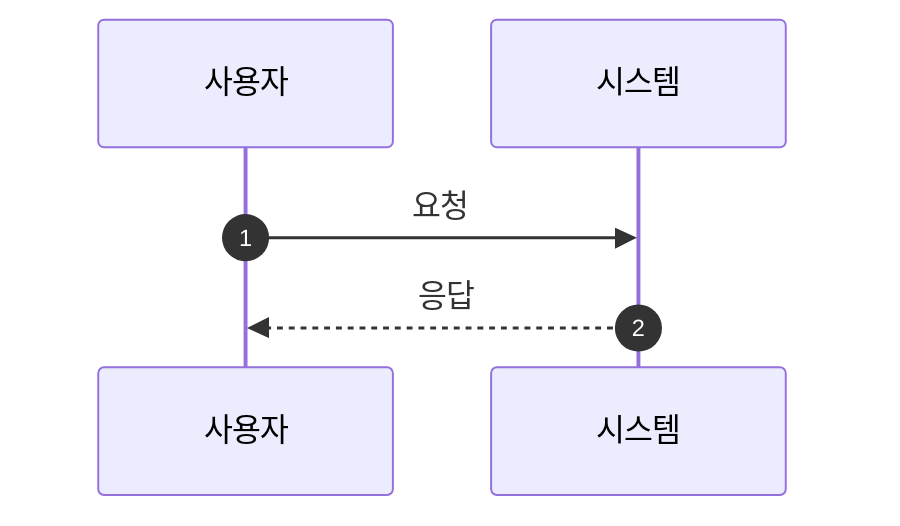

# {프로젝트명} - Claude 작업 지침서

작성자: Claude (Sonnet 4.5)
작성일: {YYYY-MM-DD}
프로젝트: {프로젝트명}

---

## 목차

1. [프로젝트 개요](#프로젝트-개요)
2. [워크플로우](#워크플로우)
3. [전문 스킬 활용](#전문-스킬-활용)
4. [글로벌 가이드라인](#글로벌-가이드라인)
5. [문서 작성](#문서-작성)
6. [협업 가이드라인](#협업-가이드라인)

---

## 프로젝트 개요

### 서비스 소개

**프로젝트명**: {프로젝트명}
**목적**: {프로젝트의 핵심 목적}
**비즈니스 목표**:
- 목표 1
- 목표 2
- 목표 3

**타겟 사용자**: {타겟 사용자 설명}

### 핵심 가치

1. **가치 1**: {설명}
2. **가치 2**: {설명}
3. **가치 3**: {설명}

### 주요 기능

1. **기능 1** (우선순위: 높음)
   - 설명

2. **기능 2** (우선순위: 중간)
   - 설명

### 프로젝트 구조

```
project-name/
├── docs/              # 로컬 문서
│   ├── specs/        # 사양서
│   └── design/       # 화면 정의서
├── src/              # 소스 코드
└── wiki/             # Wiki 문서 (Confluence)
    ├── 기획/
    ├── 개발/
    └── 운영/
```

---

## 워크플로우

### Brainstorm → Plan → Execute

이 프로젝트는 3단계 워크플로우를 따릅니다.

#### Phase 1: Brainstorming

**목적**: 요구사항 명확화 및 설계 방향 수립

**수행 작업**:
1. 요구사항 이해
2. 소크라틱 질문
3. 기존 사양 분석
4. 충돌 체크
5. 설계 방향 제안

**산출물**:
- 명확화된 요구사항
- 설계 제안서

#### Phase 2: Planning

**목적**: 상세 설계 및 작업 분해

**수행 작업**:
1. 기능 세분화
2. 상세 명세 작성
3. 테스트 케이스 정의

**산출물**:
- 화면 정의서
- API 명세서
- 테스트 케이스

#### Phase 3: Execution

**목적**: 검증 및 문서화

**수행 작업**:
1. 검증 (데이터, 계산식, 예외 처리)
2. Wiki 문서화

**산출물**:
- Wiki 문서 (공유 가능한 URL)

---

## 전문 스킬 활용

### 사용 가능한 스킬

1. **orchestrating**: 복잡한 문제 분석 및 스킬 조율
2. **benchmarking**: 경쟁사 비교 분석
3. **data-analyzing**: 데이터 지표 정의 및 검증
4. **systematic-debugging**: Jira 이슈 분석

### 스킬 사용 원칙

**스킬 사용 전 반드시 알림:**
```
"저는 {스킬 이름} 스킬을 사용하여 {작업}을 진행합니다."
```

---

## 글로벌 가이드라인

### 기본 원칙

- **언어**: 한국어
- **문서 형식**: Markdown
- **이모지**: 사용 금지
- **작성자**: Claude (Sonnet 4.5)

### 문서 작성 원칙

- **명확성**: 기술 용어를 모르는 사람도 이해 가능
- **간결성**: 핵심만 전달
- **일관성**: 용어, 표기법 통일
- **검증 가능성**: 데이터 출처 명시

### 문서 참조 우선순위

1. 사양서
2. 화면 정의서
3. API 명세서
4. Wiki 문서

---

## 문서 작성

### Wiki 구조

```yaml
최상위_URL: {Wiki 최상위 페이지 URL}
최상위_pageId: {페이지 ID}

기본_업로드_URL: {Skills 문서 업로드 위치 URL}
기본_업로드_pageId: {페이지 ID}
```

### Mermaid 다이어그램 규칙

**안전한 작성 원칙**:
- participant는 8개 이하
- subgraph는 2개까지
- 특수문자 최소화

**Sequence Diagram 예시**:


---

## 협업 가이드라인

### 문서 관리

- **기획서**: Google Drive
- **화면 정의서**: Figma + Wiki
- **API 명세서**: Wiki

### Slack 채널

- `#{프로젝트-채널}` - {Slack URL}

### Jira 티켓 작성

```markdown
## 제목
[{프로젝트}] {기능명} {작업 내용}

## 설명
### 배경
{왜 필요한가?}

### 요구사항
1. {요구사항 1}

### 검증 방법
{검증 방법}
```

---

## 주요 데이터 소스

### API 1

| 엔드포인트 | 용도 | 주요 필드 |
|-----------|------|-----------|
| /api/v1/... | ... | ... |

### API 2

| 엔드포인트 | 용도 | 주요 필드 |
|-----------|------|-----------|
| /api/v1/... | ... | ... |

---

## 참고 문서

### 프로젝트 문서
- **사양서**: {링크}
- **Figma**: {링크}

### Wiki 문서
- **프로젝트 Wiki**: {링크}

### API 문서
- **API 문서**: {링크}

---

**문서 버전**: 1.0.0
**최종 수정**: {YYYY-MM-DD}
**작성자**: Claude (Sonnet 4.5)
**주요 변경사항**:
- 초기 작성
