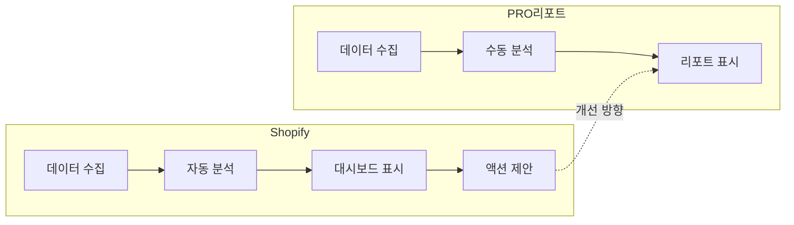
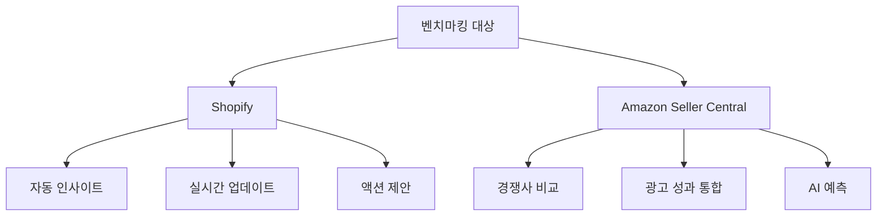

# Benchmarking

## 개요

이 스킬은 글로벌 E-commerce 선두 기업들의 최신 기능, UX, 데이터 활용 방식을 분석하고 비교하는 전문가 스킬입니다.

**핵심 원칙**:
- **Fact 기반 필수**: 추측 금지, WebSearch/WebFetch로 최신 정보만 사용
- **최신 정보**: 2024-2025년 정보 우선, 오래된 정보는 경고 표시
- **비교 대상 제한**: 한 번에 최대 2-3개 대상만 비교 (정보 과부하 방지)
- **Compact 출력**: Bullet point + 비교표 + 다이어그램 + 실행 가능한 권장사항
- **Wiki 문서화**: 모든 벤치마킹 결과는 mpm 스킬로 Wiki에 저장
- **이모지 사용 금지**: 모든 벤치마킹 산출물(비교표, 권장사항, Wiki 문서)에서 이모지 사용을 금지합니다

## 비교 대상 기업

### 기본 비교 대상 (우선순위)

1. **Shopify**: E-commerce 플랫폼 (대시보드 UX, 데이터 시각화, 앱 생태계)
2. **Google Analytics 4 / Google Merchant Center**: 데이터 분석 도구 (정확성, 실시간 분석)
3. **Amazon Seller Central**: 마켓플레이스 판매자 도구 (상세 매출 분석, 경쟁사 비교)

### 추가 비교 대상 (상황별)

4. **쿠팡 Wing / 파트너스**: 한국 마켓플레이스 (로켓배송 데이터, 한국 시장 특화)
5. **네이버 스마트스토어 센터**: 한국 E-commerce 플랫폼 (네이버 검색 연동, 한국 UX)
6. **eBay Seller Hub**: 글로벌 마켓플레이스 (글로벌 판매 데이터, 다국가 비교)

전체 리스트는 `references/global_ecommerce_targets.md` 참조.

## 벤치마킹 워크플로우

### 1. 요청 분석 및 대상 선정

**입력 예시**:
- "Shopify 대시보드와 우리 PRO 리포트 비교해줘"
- "Amazon Seller Central의 데이터 시각화 방식 분석해줘"
- "쿠팡과 네이버의 판매자 리포트 기능 비교해줘"

**처리**:
```
1. 요청에서 핵심 비교 대상 추출 (최대 2-3개)
2. 비교 목적 명확화 (UI/UX, 기능, 데이터 활용)
3. 검색 키워드 준비
   - UI/UX: "[대상] admin dashboard 2024"
   - 기능: "[대상] analytics features 2024"
   - 데이터: "[대상] data-driven insights 2024"
```

### 2. 최신 정보 수집 (WebSearch/WebFetch)

**필수 도구**:
- `WebSearch`: 최신 기사, 공식 블로그, 업데이트 정보
- `WebFetch`: 공식 문서, 제품 페이지, 스크린샷

**검색 전략**:
```markdown
# 단계별 검색

## Step 1: 공식 소스 확인
- "[대상] official documentation 2024"
- "[대상] release notes 2024"
- "[대상] product updates 2024"

## Step 2: 실제 사용 사례
- "[대상] dashboard screenshots 2024"
- "[대상] user guide 2024"
- "how to use [대상] reports 2024"

## Step 3: 비교 분석 자료
- "[대상] vs [경쟁사] comparison 2024"
- "[대상] best practices 2024"
- "[대상] review 2024"
```

**정보 검증**:
- 발행일 확인: 2024-2025년 정보 우선
- 출처 신뢰도: 공식 사이트 > 기술 블로그 > 일반 기사
- 오래된 정보 발견 시: "⚠️ 2023년 이전 정보입니다. 최신 확인 필요"

### 3. 구조화된 비교 분석

**비교 프레임워크**:

```markdown
# [비교 주제] 벤치마킹

작성일: {YYYY-MM-DD}
비교 대상: {대상1}, {대상2}
출처: {URL 리스트}

## 1. 핵심 기능 비교

| 항목 | {대상1} | {대상2} | 차이점 |
|------|---------|---------|--------|
| 기능 A | 제공 | 미제공 | {설명} |
| 기능 B | {세부사항} | {세부사항} | {설명} |

## 2. UI/UX 비교

### {대상1}
- 장점:
  - {장점1}
  - {장점2}
- 단점:
  - {단점1}

### {대상2}
- 장점:
  - {장점1}
- 단점:
  - {단점1}

## 3. 데이터 활용 방식

[Mermaid 다이어그램]

## 4. 즉시 실행 가능한 권장사항

1. **단기 (1-2주)**:
   - {구체적 액션1}
   - {구체적 액션2}

2. **중기 (1-2개월)**:
   - {구체적 액션1}

3. **장기 (3개월+)**:
   - {구체적 액션1}

## 5. 참고 자료

- [{대상1} 공식 문서]({URL})
- [{대상2} 공식 문서]({URL})
```

### 4. Mermaid 다이어그램 생성

**비교 흐름도 예시**:



**비교 테이블 다이어그램**:



### 5. Compact 출력 형식

**Bullet Point 원칙**:
- 한 문장에 하나의 핵심 정보만
- 구체적인 수치/사례 포함
- 추상적 표현 금지

**Good 예시**:
```markdown
## Shopify Analytics 핵심 기능

- **실시간 매출 추적**: 5분 단위 업데이트, 모바일 푸시 알림 지원
- **자동 인사이트**: "지난주 대비 전환율 15% 하락" 자동 감지 및 원인 분석
- **액션 제안**: "할인 프로모션 실행" 버튼 클릭 한 번으로 즉시 캠페인 생성
- **비교 기준**: 업종 평균 대비 우리 몰 순위 표시 (상위 25%)
```

**Bad 예시** (금지):
```markdown
- Shopify는 우수한 분석 기능을 제공합니다
- 사용자 경험이 좋습니다
- 데이터를 효과적으로 활용합니다
```

### 6. Wiki 문서화 (mpm 스킬 연동)

**자동 업로드**:
```
모든 벤치마킹 결과는 mpm 스킬을 통해 자동으로 Wiki에 업로드됩니다.

기본 업로드 위치:
- URL: https://wiki.simplexi.com/pages/viewpage.action?pageId=2800416316
- pageId: 2800416316

문서 제목 형식: "[벤치마킹] {대상} vs PRO 리포트 - {비교 주제} ({YYYY-MM-DD})"
```

**Wiki 문서 구조**:
```markdown
# [벤치마킹] Shopify vs PRO 리포트 - 대시보드 UX (2025-01-15)

작성자: Claude (Sonnet 4.5) - benchmarking 스킬
출처: [URL 리스트]

## 요약
{3줄 요약}

## 비교 분석
{비교표 + 다이어그램}

## 권장사항
{즉시 실행 가능한 액션}

## 참고 자료
{링크}
```

## 벤치마킹 체크리스트

**정보 수집 전**:
- [ ] 비교 대상을 2-3개로 제한했는가?
- [ ] 비교 목적이 명확한가? (UI/UX, 기능, 데이터 활용)
- [ ] 검색 키워드에 "2024" 또는 "2025"를 포함했는가?

**정보 수집 중**:
- [ ] WebSearch로 최신 정보를 찾았는가?
- [ ] WebFetch로 공식 문서를 확인했는가?
- [ ] 발행일이 2024-2025년인가?
- [ ] 출처가 신뢰할 수 있는가?

**분석 및 출력**:
- [ ] 비교표에 구체적 정보를 채웠는가? (추측 없음)
- [ ] Mermaid 다이어그램을 포함했는가?
- [ ] Bullet point가 간결하고 구체적인가?
- [ ] 즉시 실행 가능한 권장사항을 제공했는가?
- [ ] 참고 자료 URL을 명시했는가?

**Wiki 문서화**:
- [ ] mpm 스킬로 자동 업로드했는가?
- [ ] 문서 제목에 날짜를 포함했는가?
- [ ] 작성자를 명시했는가?

## 특수 상황 처리

### 최신 정보를 찾을 수 없는 경우

```markdown
⚠️ **최신 정보 부족 경고**

- 검색 결과: 2023년 이전 정보만 발견
- 대응: 공식 사이트 직접 확인 필요
- 권장: [대상] 공식 블로그/릴리즈 노트 확인 후 재분석

현재까지 확인된 정보:
- {2023년 정보 요약}
- 출처: {URL}
```

### 비교 대상이 3개를 초과하는 경우

```markdown
요청: Shopify, Amazon, Google Analytics, 쿠팡, 네이버 모두 비교

대응:
→ 우선순위 1: Shopify vs Amazon (글로벌 대표 플랫폼)
→ 우선순위 2: 쿠팡 vs 네이버 (한국 시장)
→ Google Analytics는 별도 분석 권장 (목적이 다름)

2개 그룹으로 나누어 순차 진행하시겠습니까?
```

### 비교 불가능한 항목

```markdown
| 항목 | Shopify | PRO 리포트 | 비고 |
|------|---------|------------|------|
| AI 재고 예측 | 제공 | 미제공 | 비즈니스 모델 차이로 직접 비교 불가 |
```

## Orchestrating 스킬 연동

이 benchmarking 스킬은 orchestrating 스킬의 전문가로 동작합니다.

**호출 방식**:
```
사용자: "Shopify와 Amazon Seller Central의 리포트 기능을 비교해줘"

orchestrating:
  └─→ 판단: 단일 도메인 전문가 스킬
  └─→ 위임: benchmarking 스킬 실행
  └─→ 결과: Wiki 문서화 (mpm 스킬 자동 호출)
```

**다른 스킬과 협업**:
```
사용자: "Shopify 벤치마킹 후 PRO 리포트 개선안 기획해줘"

orchestrating:
  └─→ 판단: 순차 오케스트레이션 (Mode A)
  └─→ Step 1: benchmarking 스킬 (비교 분석)
  └─→ Step 2: brainstorming 스킬 (개선안 기획)
  └─→ Step 3: mpm 스킬 (Wiki 통합 문서화)
```

## Resources

### references/

이 스킬은 다음 참조 문서를 포함합니다:

- **`global_ecommerce_targets.md`**: 글로벌 E-commerce 비교 대상 리스트
  - 기본 비교 대상 3개 (Shopify, Google, Amazon)
  - 추가 비교 대상 3개 (쿠팡, 네이버, eBay)
  - 비교 시 주의사항
  - 검색 키워드 가이드

이 문서는 벤치마킹 대상 선정 시 참조하며, 항상 최신 정보로 업데이트되어야 합니다.

## 예시: 전체 워크플로우

**요청**:
```
"Shopify 대시보드와 우리 PRO 리포트의 UX를 비교해줘"
```

**Step 1: 대상 선정**
```
비교 대상: Shopify (1개만, 명확함)
비교 목적: 대시보드 UX
검색 키워드: "Shopify admin dashboard 2024"
```

**Step 2: 정보 수집**
```
WebSearch: "Shopify admin dashboard 2024"
→ 결과: Shopify 공식 블로그 "2024 Dashboard Updates"
→ 발행일: 2024-09-15 ✓

WebFetch: https://www.shopify.com/admin
→ 최신 스크린샷 확인
→ 주요 기능: 실시간 매출, AI 인사이트, 원클릭 액션
```

**Step 3: 비교 분석**
```markdown
# [벤치마킹] Shopify vs PRO 리포트 - 대시보드 UX

## 핵심 기능 비교

| 항목 | Shopify | PRO 리포트 | 차이점 |
|------|---------|------------|--------|
| 실시간 업데이트 | 5분 단위 | 월 1회 (매월 3일) | Shopify 더 빈번 |
| AI 인사이트 | 자동 생성 | 미제공 | 핵심 차별점 |
| 액션 버튼 | 원클릭 | 링크만 제공 | UX 개선 필요 |

## Mermaid 다이어그램
[다이어그램 생성]

## 즉시 실행 가능한 권장사항

1. **단기**: PRO 리포트에 "지난달 대비 변화" 자동 코멘트 추가
2. **중기**: 주요 지표에 "지금 할인 시작" 원클릭 버튼 추가
3. **장기**: 실시간 업데이트 기능 검토
```

**Step 4: Wiki 문서화**
```
mpm 스킬 호출:
→ 제목: "[벤치마킹] Shopify vs PRO 리포트 - 대시보드 UX (2025-01-15)"
→ 업로드 위치: pageId 2800416316
→ 완료: Wiki URL 반환
```

---

**이 스킬은 orchestrating 스킬과 함께 사용하도록 설계되었습니다.**
