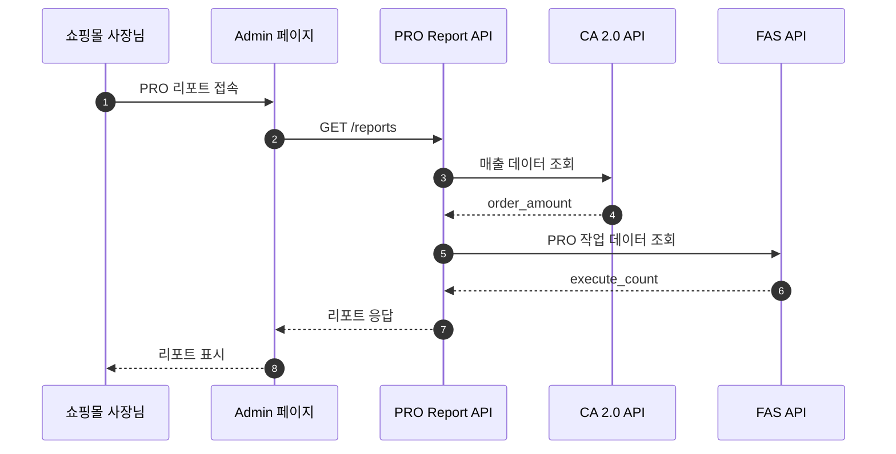

# 카페24 PRO 리포트 - Claude 작업 지침서 (기획자용)

작성자: Claude (Sonnet 4.5)
작성일: 2025-11-14
프로젝트: 카페24 PRO 리포트

---

## 목차

1. [프로젝트 개요](#프로젝트-개요)
2. [스킬 사용 우선순위](#스킬-사용-우선순위)
3. [기획 문서 작성 프로세스 (brainstorming/writing-plans 필수)](#기획-문서-작성-프로세스-brainstormingwriting-plans-필수)
4. [Superpowers 스킬 활용 (그 외 작업)](#superpowers-스킬-활용-그-외-작업)
5. [글로벌 가이드라인](#글로벌-가이드라인)
6. [Jira/Wiki 분석 및 처리](#jirawiki-분석-및-처리)
7. [데이터 검증 프로세스](#데이터-검증-프로세스)
8. [Wiki 문서 작성 (mpm 필수)](#wiki-문서-작성-mpm-필수)
9. [Mermaid 다이어그램 작성 규칙](#mermaid-다이어그램-작성-규칙)
10. [협업 가이드라인](#협업-가이드라인)

---

## 프로젝트 개요

### 서비스 소개

**프로젝트명**: 카페24 PRO 리포트
**목적**: PRO의 성과를 '증명'하고, 이를 바탕으로 매출 성장을 위한 마케팅 행동을 '유도'하는 월간 성장 리포트
**비즈니스 목표**:
- Proof + Inducement: 투자 가치 증명을 넘어, 실제 마케팅 액션(SNS, 광고) 연결
- 선순환 구조 구축: 증명(데이터) → 유도(액션) → 강화(성장) → 재증명
- 관리 효율화: 사장님 스스로 문제를 인지하고 해결책(PRO 기능)을 선택하도록 유도 타겟 사용자: 카페24 PRO 서비스를 이용하는 쇼핑몰 사장님
**타겟 사용자**: 카페24 PRO 서비스를 이용하는 쇼핑몰 사장님

### 핵심 가치 (3가지)
1. **성장 여정 중심**: 각자의 성장과 변화를 보여주는 여정 관리
2. **데이터 기반 자동 리포트**: 매월 3일 자동 업데이트
3. **피드백 루프**: 데이터 진단 → 문제 발견(Red Indicator) → 액션 제안(SNS/광고) → 지표 개선

### 주요 기능 (우선순위 순)
1. **상단 핵심 카드** (최우선)
   - PRO가 만들어준 매출
   - 절약한 시간/비용
   - PRO 혜택
2. **아바타 인사이트** (최우선)
   - 시간→비용 환산, PRO 평균 비교
3. **매출 추이** - 자사몰 vs 연동 마켓
4. **PRO 매출 기여도** - SEO, CRM, 프로모션, 채널 판매
5. **쇼핑몰 운영 현황** - KPI 6개 지표
6. **PRO 처리 업무** - 처리 건수, 시간
7. **후불 광고 배너** (조건부)

### 데이터 기준
- **데이터 단위**: 월간
- **업데이트 주기**: 매월 3일 오전 8시 자동
- **제공 기준**: PRO 승인된 몰 대상, 승인된 월부터 제공
- **이용 쇼핑몰**: 샵 단위, PRO 국내몰만 (1차수)

### 비즈니스 규칙
**리포트 타입 분기**:
| 타입 | 조건 | 노출 섹션 |
|------|------|-----------|
| 타입 1 (Full) | 자사몰 매출 ≥ 100만원 | 전체 |
| 타입 2 (Lite) | 자사몰 < 100만원 AND 연동 마켓 ≥ 100만원 | 상단 카드(3개) + 매출 추이 + PRO 성과 |
| 타입 3 (Mini) | 자사몰·연동 마켓 모두 < 100만원 | 상단 카드(2개) + PRO 성과만 |

**매출 기여도/PRO 처리 업무**: 각 항목 = 0일 경우 넛지 화면 또는 미노출
**후불 광고**: 사용몰 → 배너 미노출, 미사용몰 → 배너 노출

### 데이터 소스
**CA 2.0 API**: 매출 분석, 전환율, 트래픽
**FAS API**: PRO 승인 정보, 작업 현황, 절약 시간, 혜택
**마켓 플러스 API**: 연동 마켓 매출
**프로모션/상품 API**: 프로모션 성과, 상품 등록/수정

### 프로젝트 구조
```
pro-report/
├── docs/ # 로컬 기획 문서
│ ├── 사양서/ # 요구사항 명세서
│ ├── 화면정의서/ # 화면 설계
│ └── API명세서/ # API 정의
├── jira/ # Jira 티켓 분석 리포트
│ └── {jira_code}_report_{date}.md
└── wiki/ # Wiki 문서 (Confluence 구조)
├── ★ [풀오토데이터TF] PRO 리포트/ # 기획/PM 공간 https://wiki.simplexi.com/pages/viewpage.action?pageId=2786894793
│ ├── 03. PRO 리포트 사양서/
│ ├── 04. 사양서 / 기준값/
│ ├── 05. 기획 분석/
│ ├── 06. Skills 분석/
│ └── 000. PRO 리포트 회의록/
└── EC개발5팀 :: MSA :: Cafe24PRO 리포트/ # 개발 공간 https://wiki.simplexi.com/pages/viewpage.action?pageId=2789437586
├── 개발가이드/
├── 설계/ <-- 기술 설계 문서 위치
├── 이슈/
└── 필요 API 조사 / 분석/
```

---

## 스킬 사용 우선순위

### 작업 유형별 스킬 선택 가이드
**모든 작업을 시작하기 전에 반드시 작업 유형을 식별하고 해당 스킬을 사용:**

#### 1. 기획 문서 작성 → brainstorming/writing-plans 스킬 (필수)
**사용 조건:**
- 새로운 기능 기획
- 요구사항 명세서 작성
- 화면 정의서 작성
- 데이터 정의서 작성
- 사용자 시나리오 작성

**필수 사용 문구:**
```
"brainstorming 스킬 사용해서 {기능명} 기획해줘"
"writing-plans 스킬 사용해서 {문서명} 작성해줘"
```

**예시:**
- "brainstorming 스킬 사용해서 고객 성장 단계 지표 기획해줘"
- "writing-plans 스킬 사용해서 매출 기여도 화면 정의서 작성해줘"

**절대 원칙: 기획 문서 작성은 반드시 brainstorming 또는 writing-plans 스킬을 사용해야 합니다.**

---

#### 2. Wiki 문서 관리 → mpm 스킬 (필수)
**사용 조건:**
- Wiki 페이지 생성
- Wiki 페이지 업데이트
- API 프로세스 문서화
- 설계 문서 검토
- Jira 분석 결과 문서화

**필수 사용 문구:**
```
"mpm으로 이 기획서를 Wiki에 업로드해줘"
"mpm 스킬 사용해서 {문서명}을 Wiki에 생성해줘"
```

**예시:**
- "mpm으로 PRO 리포트 데이터 정의서를 Wiki에 업로드해줘"
- "mpm 스킬 사용해서 API 프로세스 문서를 Wiki에 생성해줘"

**절대 원칙: Wiki 작업은 반드시 mpm 스킬을 사용해야 합니다.**

---

#### 3. 그 외 모든 작업 → Superpowers 스킬 (우선)

**해당 작업:**
- Jira 티켓 분석
- 데이터 검증
- 계산식 검증
- 요구사항 명확화
- 이슈 분석
- 문제 해결

**필수 작업 시작 전 체크리스트:**

1. ☐ 기획 문서 작성인가? → YES: brainstorming 또는 writing-plans 사용
2. ☐ Wiki 작업인가? → YES: mpm 스킬 사용
3. ☐ 그 외 작업인가? → YES: 아래 superpowers 스킬 체크리스트 진행
4. ☐ 사용 가능한 superpowers 스킬 목록 확인
5. ☐ 현재 작업에 해당하는 스킬이 있는가?
6. ☐ 있다면 → 해당 스킬 실행
7. ☐ 어떤 스킬을 사용하는지 사용자에게 명시적으로 알림
8. ☐ 스킬의 지침을 정확히 따름

**이 체크리스트를 건너뛰면 안 됩니다. 스킬이 있으면 반드시 사용해야 합니다.**

---

## 기획 문서 작성 프로세스 (brainstorming/writing-plans 필수)

### brainstorming 스킬

**사용 시기**: 새로운 기능/개선사항 기획 시

**프로세스**:
1. 문제 정의 - 해결할 비즈니스 문제 명확화
2. 소크라테스식 질문 - 핵심 요구사항 도출
3. 데이터 요구사항 - 필요 데이터 소스/필드 정의
4. 화면 구성 - UX 설계
5. 비즈니스 로직 - 계산식/규칙 정의

**예시:**
```
사용자: "PRO 리포트에 고객 성장 단계 지표 추가하고 싶어"

Claude: "brainstorming 스킬을 사용하여 설계하겠습니다."

[질문]
1. 성장 단계를 어떻게 정의? (매출/사용기간/활동성?)
2. 어떤 데이터 필요? (현재/과거 매출, 기능 사용 빈도)
3. 어떤 인사이트 제공? (현재 위치, 다음 단계, 권장 액션)
4. 화면 표시 방법? (배지/진행바/로드맵?)
```

### writing-plans 스킬

**사용 시기**: 기획 완료 후 상세 구현 계획 필요 시

**산출물**:
- API 설계 (엔드포인트, 파라미터)
- 데이터 흐름 (수집 → 가공 → 표시)
- 화면 정의서 (섹션별 명세)
- 예외 처리 (데이터 없음, 오류 대응)
- 검증 계획

---

## Superpowers 스킬 활용 (그 외 작업)

### 적용 대상

**다음 작업에서 superpowers 스킬을 우선적으로 사용:**
- Jira 티켓 분석
- 데이터 검증
- 계산식 검증
- 요구사항 명확화
- 이슈 분석
- 문제 해결

**기획 문서 작성은 제외 (brainstorming/writing-plans 스킬 사용)**
**Wiki 작업은 제외 (mpm 스킬 사용)**

### 주요 Superpowers 스킬 및 사용 시기

#### 1. 분석 및 디버깅

**systematic-debugging** (`superpowers:systematic-debugging`)
- **사용 시기**: Jira 티켓 분석, 데이터 오류 발견 시
- **목적**: 솔루션 제안 전 근본 원인 파악
- **4단계 프레임워크**:
  1. 근본 원인 조사
  2. 패턴 분석
  3. 가설 테스트
  4. 해결 방안

#### 2. 검증 및 완료

**verification-before-completion** (`superpowers:verification-before-completion`)
- **사용 시기**: 데이터 정의, 계산식 검증 시
- **목적**: 완료 주장 전 증거 확보
- **필수 사항**:
  - 데이터 소스 확인
  - 계산식 검증
  - 예외 상황 대응
  - 비즈니스 규칙 준수

### 합리화 방지

**다음과 같은 생각이 들면 즉시 중단하고 스킬을 확인하십시오:**

- "이것은 단순한 질문일 뿐이야" → 잘못됨. 질문도 태스크입니다. 스킬 확인 필요.
- "먼저 정보를 수집하자" → 잘못됨. 스킬이 정보 수집 방법을 알려줍니다. 스킬 확인 필요.
- "이것에는 스킬이 과도해" → 잘못됨. 스킬은 단순한 것이 복잡해지기 때문에 존재합니다. 사용하세요.
- "공식 스킬이 필요하지 않아" → 잘못됨. 스킬이 존재하면 사용하세요.

### 스킬 사용 알림

**스킬을 사용하기 전에 반드시 사용자에게 알려야 합니다:**

형식: "저는 [스킬 이름] 스킬을 사용하여 [무엇을 하는지]를 진행합니다."

예시:
- "저는 brainstorming 스킬을 사용하여 아이디어를 설계로 발전시킵니다."
- "저는 systematic-debugging 스킬을 사용하여 이 이슈를 분석합니다."
- "저는 mpm 스킬을 사용하여 Wiki에 문서를 업로드합니다."

---

## 글로벌 가이드라인

### 기본 원칙
- **언어**: 모든 답변과 문서는 한국어로 작성
- **문서 형식**: Markdown 형식 활용
- **이모지**: 사용 금지
- **작성자 명시**: 모든 문서에 작성자(Claude Sonnet 4.5) 기입

### 문서 작성 원칙
- **명확성**: 기술 용어를 모르는 사람도 이해할 수 있도록
- **간결성**: 핵심만 전달, 불필요한 내용 제외
- **일관성**: 용어, 표기법 통일
- **검증 가능성**: 데이터 출처 명시

### 문서 참조 우선순위
1. **사양서**: 전체 요구사항 및 데이터 정의
2. **화면 정의서**: Figma 디자인 시안 연계
3. **데이터 정의서**: 지표별 계산식 및 데이터 소스
4. **API 명세서**: CA 2.0, FAS, 마켓 플러스 API
5. **Wiki 문서**: 협업 히스토리 및 의사결정 기록

---

## Jira/Wiki 분석 및 처리

### 실행 조건

**다음 조건을 모두 만족할 때만 실행:**
- Jira 티켓 코드/링크를 받았을 때
- 사용자가 명시적으로 분석 요청했을 때

**그 외의 요청은 일반적으로 진행**

### Superpowers 스킬 기반 분석 프로세스

**1단계**: `systematic-debugging` - 문제 분석
- Jira 본문/댓글 분석
- 관련 사양서 검토
- 재현 조건 파악

**2단계**: `brainstorming` - 요구사항 명확화
- 불명확한 부분 질문
- 데이터 요구사항 도출
- 비즈니스 규칙 정의

**3단계**: `writing-plans` - 해결 방안 수립
- 수정 계획 작성
- 화면 정의서 작성
- 예상 소요 시간 산정

**4단계**: `verification-before-completion` - 검증 계획

**5단계**: `mpm` - Wiki 문서화

### 분석 리포트 템플릿

```markdown
# Jira 분석 리포트

작성자: Claude (Sonnet 4.5)
작성일: {YMDHis}
대상: {Jira Code}

## 1. 요약
{간단한 요약}

## 2. 문제 분석
{근본 원인, 패턴, 가설 검증}

## 3. 요구사항 명확화
{핵심 요구사항, 데이터, 화면}

## 4. 해결 방안
{수정 대상, 상세 계획, 소요 시간}

## 5. 리스크
{예상 리스크, 대응 방안}

## 6. 검증 계획
{테스트/검증 방법}
```

---

## 데이터 검증 프로세스

### verification-before-completion 스킬

**검증 항목**:

1. **데이터 소스 확인**
   - API 엔드포인트 정확성
   - 파라미터 누락 여부
   - 응답 필드 존재 여부

2. **계산식 검증**
   - 수식 논리 정확성
   - 단위 일관성
   - 반올림 규칙 준수

3. **예외 상황 대응**
   - 0으로 나누기 방지
   - NULL 값 처리
   - 음수 값 처리

4. **비즈니스 규칙 준수**
   - 타입별 분기 조건
   - 노출/미노출 조건

### systematic-debugging 스킬

**4단계 프레임워크**:

1. **근본 원인 조사**: 데이터 흐름 추적
2. **패턴 분석**: 유사 오류 패턴 식별
3. **가설 테스트**: 추정 원인 검증
4. **해결 방안**: 수정 계획 수립

---

## Wiki 문서 작성 (mpm 필수)

### 기본 설정

**PRO 리포트 Wiki 구조**:
```yaml
# PRO 리포트 최상위 페이지 (모든 위키 문서의 루트)
최상위_URL: https://wiki.simplexi.com/pages/viewpage.action?pageId=2786894793
최상위_pageId: 2786894793

# Skills로 생성한 문서 업로드 위치 (mpm 스킬 사용 시 기본값)
기본_업로드_URL: https://wiki.simplexi.com/pages/viewpage.action?pageId=2800416316
기본_업로드_pageId: 2800416316
```

**문서 작성 원칙**:
- 언어: 한국어
- 이모지: 사용 금지
- 다이어그램: Mermaid 필수

### mpm 스킬 사용

**기본 사용법**:
```bash
# 기본 업로드 위치(pageId: 2800416316)에 자동 업로드
"mpm으로 이 기획서를 Wiki에 업로드해줘"
"mpm 스킬 사용해서 데이터 정의서를 Wiki에 생성해줘"

# 특정 부모 페이지 지정
"mpm으로 JIRA-12345 분석 결과를 Wiki pageId 2786894793 하위에 업로드해줘"
```

**중요**: mpm 스킬 사용 시 부모 페이지를 지정하지 않으면 기본적으로 pageId `2800416316` 하위에 생성됩니다.

### Wiki 페이지 구조

```
PRO 리포트 (최상위, pageId: 2786894793)
├── 프로젝트 개요
├── 요구사항 명세서 (사양서)
├── 화면 정의서
├── 데이터 정의서
├── API 명세서
└── Skills 생성 문서 (기본 업로드 위치, pageId: 2800416316)
    ├── Jira 분석 리포트
    ├── 데이터 검증 리포트
    └── 설계 검토 문서
```

**문서 업로드 규칙**:
- mpm 스킬로 자동 생성하는 문서 → pageId `2800416316` 하위
- 수동 작성하는 기획 문서 → 해당 카테고리 하위 (프로젝트 개요, 사양서 등)

---

## Mermaid 다이어그램 작성 규칙

### 안전한 Mermaid 작성 원칙

**필수 준수사항:**
- participant는 8개 이하로 제한
- subgraph는 최대 2개까지만 사용
- 특수문자 사용 최소화
- 한글 레이블 사용 가능

**피해야 할 패턴:**
- 복잡한 중첩 구조
- 과도한 분기(alt/par)
- 특수문자 남용

**권장 패턴:**
- 단순하고 명확한 흐름
- 핵심 프로세스에 집중
- 부가 설명은 텍스트로 보충

### Sequence Diagram 예시



### Confluence Mermaid 매크로 형식

```xml
<ac:structured-macro ac:name="mermaid-macro" ac:schema-version="1">
<ac:plain-text-body><![CDATA[
sequenceDiagram
  autonumber
  participant User
  participant System
  
  User->>System: 요청
  System-->>User: 응답
]]></ac:plain-text-body>
</ac:structured-macro>
```

**주요 특징:**
- 매크로명: `mermaid-macro`
- CDATA 섹션 필수: 특수문자 보호
- 스키마 버전: `ac:schema-version="1"`

---

## 협업 가이드라인

### 기획 문서 관리

- **기획서**: Google Drive (Google Docs)
- **화면 정의서**: Figma + Wiki
- **API 명세서**: Wiki
- **데이터 정의서**: Wiki + Google Sheets

### Jira 티켓 작성

```markdown
## 제목
[PRO 리포트] {기능명} {작업 내용}

## 설명
### 배경
{왜 필요한가?}

### 요구사항
1. {요구사항 1}
2. {요구사항 2}

### 화면 정의
- Figma: {링크}
- Wiki: {링크}

### 데이터 소스
- API: {엔드포인트}
- 필드: {필드}
- 계산식: {계산식}

### 예외 처리
- {예외 상황}: {대응}

### 검증 방법
{검증 방법}
```

### Slack 채널

- `#p-cafe24pro-리포트` - https://cafe24.enterprise.slack.com/archives/C09AR1W782H

### 리뷰 프로세스

1. **팀 내 리뷰** (1~2일)
   - 요구사항 명확성, 데이터 정합성

2. **개발팀 리뷰** (1~2일)
   - 기술적 실현 가능성, API 가용성

3. **CTO 리뷰** (3~5일, 필요 시)
   - 조건: DB 구조 변경, File I/O 변경, 2주 이상 개발
   - 아키텍처, 성능, 보안

---

## 주요 데이터 소스

### CA 2.0 API

| 엔드포인트 | 용도 | 주요 필드 |
|-----------|------|-----------|
| /ca2/sales/overview | 매출 종합 | order_amount |
| /ca2/adsources/channels | 채널별 분석 | channel, order_amount |
| /ca2/conversion/rate | 구매 전환율 | conversion_rate |
| /ca2/attribution/traffic-analysis | 트래픽 분석 | sessions, referrer_domain |

### FAS API

| 엔드포인트 | 용도 | 주요 필드 |
|-----------|------|-----------|
| /app-requests-list | PRO 승인 목록 | confirm_timestamp, status |
| /tasks/pro/report | PRO 작업 현황 | execute_count, report_type |
| /tasks/report-metrics | 월별 지표 | avg_sales |

### 마켓 플러스 API

| 엔드포인트 | 용도 | 주요 필드 |
|-----------|------|-----------|
| /api/internal/v1/order/daily-sales | 마켓 매출 | paid_order_amount |

---

## 참고 문서

### 프로젝트 문서
- **사양서**: `_풀오토_데이터_TF__PRO_리포트_사양서__작성중___3_.md`
- **Figma**: 
  - 타입 1: https://alias-slash-26808627.figma.site/
  - 타입 2: https://daisy-linear-09681413.figma.site/
  - 타입 3: https://symbol-plain-76893611.figma.site/

### Wiki 문서
- **PRO 리포트 최상위 WIKI**: https://wiki.simplexi.com/pages/viewpage.action?pageId=2786894793
- **Skills 문서 업로드 위치**: https://wiki.simplexi.com/pages/viewpage.action?pageId=2800416316
- **EC 개발 WIKI**: https://wiki.simplexi.com/pages/viewpage.action?pageId=2789416847

### API 문서
- **CA 2.0**: https://ca-api-dev.hanpda.com/gw/webjars/swagger-ui/index.html
- **FAS**: https://extsvc-qa.hanpda.com/docs#/
- **PRO Report**: https://cafe24pro-report-api-dev.hanpda.com/docs

### 참고 자료
- **5대 핵심지표**: https://docs.google.com/spreadsheets/d/1G6XltIhDA2AGT6jDOKVFWzy5ZGfZCU4BfwegW-nC7rk/
- **PRO 엔진 리스트**: https://docs.google.com/spreadsheets/d/1pXGBjAMJYyKpyrCOvB06SHNpKWHnUAgxfY5Rp80X4zI/

---
ㄴ
**문서 버전**: 1.2.0 (최종)
**최종 수정**: 2025-11-20
**작성자**: Claude (Sonnet 4.5)
**주요 특징**:
- 기획자용 내용 (비즈니스 중심)
- 개발자용 CLAUDE.md 구조 참고
- 핵심 스킬 중심 간소화 (약 550줄)