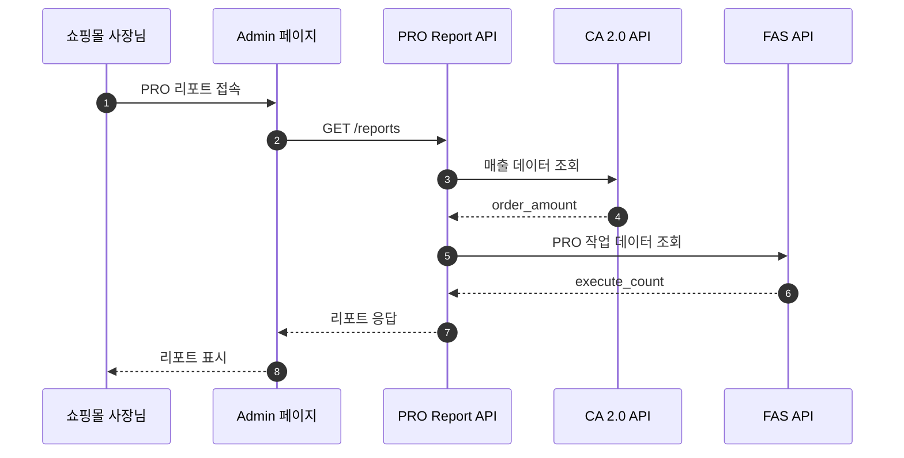

# 카페24 PRO 리포트 - Claude 작업 지침서 (기획자용)

작성자: Claude (Sonnet 4.5)
작성일: 2025-11-22
프로젝트: 카페24 PRO 리포트

---

## 목차

1. [프로젝트 개요](#프로젝트-개요)
2. [기획 워크플로우 (Brainstorm → Plan → Execute)](#기획-워크플로우-brainstorm--plan--execute)
3. [전문 스킬 활용](#전문-스킬-활용)
4. [글로벌 가이드라인](#글로벌-가이드라인)
5. [Wiki 문서 작성](#wiki-문서-작성)
6. [Mermaid 다이어그램 작성 규칙](#mermaid-다이어그램-작성-규칙)
7. [협업 가이드라인](#협업-가이드라인)

---

## 프로젝트 개요

### 서비스 소개

**프로젝트명**: 카페24 PRO 리포트
**목적**: PRO의 성과를 '증명'하고, 이를 바탕으로 매출 성장을 위한 마케팅 행동을 '유도'하는 월간 성장 리포트
**비즈니스 목표**:
- Proof + Inducement: 투자 가치 증명을 넘어, 실제 마케팅 액션(SNS, 광고) 연결
- 선순환 구조 구축: 증명(데이터) → 유도(액션) → 강화(성장) → 재증명
- 관리 효율화: 사장님 스스로 문제를 인지하고 해결책(PRO 기능)을 선택하도록 유도

**타겟 사용자**: 카페24 PRO 서비스를 이용하는 쇼핑몰 사장님

### 핵심 가치 (3가지)
1. **성장 여정 중심**: 각자의 성장과 변화를 보여주는 여정 관리
2. **데이터 기반 자동 리포트**: 매월 3일 자동 업데이트
3. **피드백 루프**: 데이터 진단 → 문제 발견(Red Indicator) → 액션 제안(SNS/광고) → 지표 개선

### 주요 기능 (우선순위 순)
1. **상단 핵심 카드** (최우선)
   - PRO가 만들어준 매출
   - 절약한 시간/비용
   - PRO 혜택
2. **아바타 인사이트** (최우선)
   - 시간→비용 환산, PRO 평균 비교
3. **매출 추이** - 자사몰 vs 연동 마켓
4. **PRO 매출 기여도** - SEO, CRM, 프로모션, 채널 판매
5. **쇼핑몰 운영 현황** - KPI 6개 지표
6. **PRO 처리 업무** - 처리 건수, 시간
7. **후불 광고 배너** (조건부)

### 데이터 기준
- **데이터 단위**: 월간
- **업데이트 주기**: 매월 3일 오전 8시 자동
- **제공 기준**: PRO 승인된 몰 대상, 승인된 월부터 제공
- **이용 쇼핑몰**: 샵 단위, PRO 국내몰만 (1차수)

### 비즈니스 규칙
**리포트 타입 분기**:
| 타입 | 조건 | 노출 섹션 |
|------|------|-----------|
| 타입 1 (Full) | 자사몰 매출 ≥ 100만원 | 전체 |
| 타입 2 (Lite) | 자사몰 < 100만원 AND 연동 마켓 ≥ 100만원 | 상단 카드(3개) + 매출 추이 + PRO 성과 |
| 타입 3 (Mini) | 자사몰·연동 마켓 모두 < 100만원 | 상단 카드(2개) + PRO 성과만 |

**매출 기여도/PRO 처리 업무**: 각 항목 = 0일 경우 넛지 화면 또는 미노출
**후불 광고**: 사용몰 → 배너 미노출, 미사용몰 → 배너 노출

### 데이터 소스
**CA 2.0 API**: 매출 분석, 전환율, 트래픽
**FAS API**: PRO 승인 정보, 작업 현황, 절약 시간, 혜택
**마켓 플러스 API**: 연동 마켓 매출
**프로모션/상품 API**: 프로모션 성과, 상품 등록/수정

### 프로젝트 구조
```
pro-report/
├── docs/ # 로컬 기획 문서
│ ├── 사양서/ # 요구사항 명세서
│ ├── 화면정의서/ # 화면 설계
│ └── API명세서/ # API 정의
├── jira/ # Jira 티켓 분석 리포트
│ └── {jira_code}_report_{date}.md
└── wiki/ # Wiki 문서 (Confluence 구조)
├── ★ [풀오토데이터TF] PRO 리포트/ # 기획/PM 공간 https://wiki.simplexi.com/pages/viewpage.action?pageId=2786894793
│ ├── 03. PRO 리포트 사양서/
│ ├── 04. 사양서 / 기준값/
│ ├── 05. 기획 분석/
│ ├── 06. Skills 분석/
│ └── 000. PRO 리포트 회의록/
└── EC개발5팀 :: MSA :: Cafe24PRO 리포트/ # 개발 공간 https://wiki.simplexi.com/pages/viewpage.action?pageId=2789437586
├── 개발가이드/
├── 설계/
├── 이슈/
└── 필요 API 조사 / 분석/
```

---

## 기획 워크플로우 (Brainstorm → Plan → Execute)

### 워크플로우 개요

```
┌─────────────────────────────────────┐
│  Phase 1: Brainstorming             │
│  /superpowers:brainstorming         │
│  • 요구사항 이해 및 명확화          │
│  • 기존 사양 분석                   │
│  • 충돌 체크 및 설계 방향 수립      │
└─────────────────────────────────────┘
              ↓
┌─────────────────────────────────────┐
│  Phase 2: Planning                  │
│  /superpowers:writing-plans         │
│  • 기능 세분화                      │
│  • 상세 명세 작성                   │
│  • 테스트 케이스 정의               │
└─────────────────────────────────────┘
              ↓
┌─────────────────────────────────────┐
│  Phase 3: Execution                 │
│  /superpowers:verification +        │
│  /superpowers:mpm                   │
│  • 최종 검증                        │
│  • Wiki 문서화                      │
└─────────────────────────────────────┘
```

---

## Phase 1: Brainstorming (요구사항 → 설계)

### 사용 스킬
`/superpowers:brainstorming`

### 수행 작업
1. **요구사항 접수 및 이해**
   - 사용자 요청 분석
   - 핵심 목적 파악

2. **소크라틱 질문으로 명확화**
   - 불명확한 부분 질문
   - 숨겨진 요구사항 발굴
   - 제약사항 확인

3. **기존 사양 분석**
   - 관련 Wiki/문서 검색
   - 현재 구현 상태 파악
   - 데이터 소스 확인

4. **충돌 체크**
   - 새 요구사항 vs 기존 사양
   - 비즈니스 규칙 충돌 여부
   - 데이터 정합성 이슈

5. **설계 방향 수립**
   - 해결 방안 제시
   - 대안 비교
   - 최적 설계 선택

### 산출물
- 명확화된 요구사항 문서
- 기존 사양 분석 요약
- 충돌 지점 및 해결 방향
- 설계 방향 제안

### 전문 스킬 연계 (필요시)
- **data-analyzing**: 데이터 지표 정의가 필요한 경우
- **benchmarking**: 경쟁사/업계 사례 참고가 필요한 경우

### 예시

```
사용자: "PRO 리포트에 고객 성장 단계 지표를 추가하고 싶어요"

Claude:
"brainstorming 스킬을 사용하여 요구사항을 명확화하고 설계 방향을 수립하겠습니다."

[Brainstorming 진행]

1. 요구사항 이해:
   Q: "고객 성장 단계"란 무엇인가요?
   Q: 매출 기준? 사용 기간? 활동성?
   Q: 목적은 현재 위치 파악? 다음 단계 유도?

2. 기존 사양 분석:
   - 현재 PRO 리포트 타입 3가지 (Full/Lite/Mini)
   - 매출 기준 분기 로직 존재
   - 상단 핵심 카드 영역 활용 가능

3. 충돌 체크:
   - 기존 타입 분기와 성장 단계 분기 충돌 가능성
   - 해결: 타입 내에서 성장 단계 표시 (타입과 독립적)

4. 설계 방향:
   - 배지 형태로 표시 (상단 카드 영역)
   - 5단계 정의 (씨앗/새싹/성장/성숙/확장)
   - 매출 + 사용 기간 복합 기준
   - 다음 단계 달성 조건 표시

[사용자 확인 대기]
```

---

## Phase 2: Planning (설계 → 상세 계획)

### 사용 스킬
`/superpowers:writing-plans`

### 수행 작업
1. **기능 세분화**
   - 큰 기능을 작은 단위로 분해
   - 각 단위별 작업 정의
   - 우선순위 설정

2. **상세 명세 작성**
   - **화면 정의**: 섹션/컴포넌트/레이아웃
   - **데이터 요구사항**: API/필드/계산식
   - **비즈니스 로직**: 조건/분기/계산식
   - **예외 상황**: 엣지 케이스 정의

3. **테스트 케이스 정의**
   - 정상 시나리오
   - 예외 시나리오
   - 검증 기준

4. **문서 구조 설계**
   - Wiki 페이지 구조
   - 다이어그램 계획
   - 참고 링크

### 산출물
- 화면 정의서 (섹션별 상세 명세)
- API 명세서 (엔드포인트/파라미터/응답)
- 비즈니스 로직 정의
- 예외 처리 시나리오
- 테스트 케이스 목록

### 전문 스킬 연계 (필요시)
- **data-analyzing**: 계산식 검증, 데이터 정합성 체크

### 예시

```
Claude:
"writing-plans 스킬을 사용하여 상세 계획을 수립하겠습니다."

[Planning 진행]

1. 기능 세분화:
   - 1.1. 성장 단계 계산 로직
   - 1.2. 배지 UI 컴포넌트
   - 1.3. 인사이트 메시지 생성
   - 1.4. 다음 단계 조건 표시

2. 화면 정의:
   - 위치: 상단 핵심 카드 영역 상단
   - 크기: 120×40px 배지
   - 색상: 단계별 차등 (초록→파랑 그라데이션)
   - 텍스트: "[단계명] + 다음 단계까지 XX만원"

3. 데이터 요구사항:
   - CA 2.0 API: order_amount (월별, 최근 12개월)
   - FAS API: confirm_timestamp (PRO 승인일)
   - 계산식:
     growth_score = (현재_월_매출 / PRO_평균_매출) × (사용_개월수 / 12)
     단계 = growth_score 구간별 매핑

"data-analyzing 스킬로 계산식을 검증하겠습니다."

4. 비즈니스 로직:
   - 씨앗 (0~0.3): PRO 시작 단계
   - 새싹 (0.3~0.6): 초기 성장
   - 성장 (0.6~1.0): 평균 도달
   - 성숙 (1.0~1.5): 평균 이상
   - 확장 (1.5+): 고성장

5. 예외 처리:
   - PRO 승인 1개월 미만: "준비중" 표시
   - 매출 0원: "씨앗" 단계 고정
   - PRO 평균 매출 데이터 없음: 절대 매출 기준 사용

6. 테스트 케이스:
   - TC1: 매출 0원, 승인 1개월 → "준비중"
   - TC2: 매출 100만원, 승인 3개월 → "새싹"
   - TC3: 매출 500만원, 승인 12개월 → "성장"
   - TC4: 매출 1000만원, 승인 24개월 → "성숙"

[사용자 확인 대기]
```

---

## Phase 3: Execution (검증 + 문서화)

### 3-1. 검증 단계

#### 사용 스킬
`/superpowers:verification-before-completion`

#### 검증 항목
1. **데이터 소스 확인**
   - API 엔드포인트 정확성
   - 파라미터 누락 여부
   - 응답 필드 존재 여부

2. **계산식 검증**
   - 수식 논리 정확성
   - 단위 일관성
   - 반올림 규칙 준수

3. **예외 상황 대응**
   - 0으로 나누기 방지
   - NULL 값 처리
   - 음수 값 처리

4. **비즈니스 규칙 준수**
   - 타입별 분기 조건
   - 노출/미노출 조건
   - 사양서 준수

5. **테스트 케이스 완성도**
   - 모든 시나리오 커버
   - 엣지 케이스 포함

#### 검증 체크리스트
- [ ] 데이터 소스 확인 완료
- [ ] 계산식 검증 완료
- [ ] 예외 상황 대응 정의 완료
- [ ] 비즈니스 규칙 충돌 없음
- [ ] 테스트 케이스 작성 완료

---

### 3-2. 문서화 단계

#### 사용 스킬
`/superpowers:mpm`

#### 수행 작업
1. **최종 문서 작성**
   - Mermaid 다이어그램 생성
   - 표/목록 정리
   - 참고 링크 추가
   - 스크린샷/Figma 링크 첨부

2. **Wiki 업로드**
   - 기본 위치: pageId `2800416316` (Skills 생성 문서)
   - 또는 지정된 부모 페이지 하위
   - 자동 포맷팅 (Confluence 형식)

3. **Jira 티켓 업데이트** (필요시)
   - Wiki 링크 추가
   - 상태 업데이트

#### 산출물
- Wiki 문서 (공유 가능한 URL)
- Jira 티켓 링크 (필요시)

#### 예시

```
Claude:
"verification 스킬로 검증 후, mpm 스킬로 Wiki에 문서화하겠습니다."

[Verification]
✓ 데이터 소스: CA 2.0 (order_amount), FAS (confirm_timestamp)
✓ 계산식: growth_score = (현재_월_매출 / PRO_평균_매출) × (사용_개월수 / 12)
✓ 예외 처리: 승인 1개월 미만, 매출 0원, 평균 데이터 없음
✓ 비즈니스 규칙: 타입과 독립적, 상단 카드 영역 사용
✓ 테스트 케이스: 4개 시나리오 정의

[Execution - Wiki 문서화]
"mpm 스킬로 Wiki에 업로드하겠습니다."

- 제목: "[PRO 리포트] 고객 성장 단계 지표 추가"
- 위치: pageId 2800416316 하위
- 다이어그램: Mermaid Sequence Diagram (데이터 흐름)
- 업로드 완료: https://wiki.simplexi.com/x/XXX
```

---

## 특수 상황별 워크플로우

### 상황 1: Jira 티켓 분석

#### 사용 스킬
`/superpowers:systematic-debugging`

#### 프로세스
1. **근본 원인 조사**
   - Jira 본문/댓글 분석
   - 관련 사양서 검토
   - 재현 조건 파악

2. **패턴 분석**
   - 유사 이슈 검색
   - 공통점 식별

3. **가설 테스트**
   - 가능한 원인 나열
   - 각 원인별 검증

4. **해결 방안 도출**
   - 단기 해결책
   - 장기 개선 방안

#### 이후 워크플로우
- **단순 버그 수정** → Plan → Execute
- **새로운 요구사항** → **Brainstorm** → Plan → Execute

#### 분석 리포트 템플릿

```markdown
# Jira 분석 리포트

작성자: Claude (Sonnet 4.5)
작성일: {YYYY-MM-DD HH:mm:ss}
대상: {Jira Code}

## 1. 요약
{한 문장 요약}

## 2. 문제 분석 (Systematic Debugging)
### 근본 원인
{분석 결과}

### 패턴 분석
{유사 이슈, 공통점}

### 가설 검증
- 가설 1: {내용} → {검증 결과}
- 가설 2: {내용} → {검증 결과}

## 3. 해결 방안
### 단기 (즉시 적용)
{내용}

### 장기 (개선 사항)
{내용}

## 4. 리스크
{예상 리스크 및 대응 방안}

## 5. 검증 계획
{테스트 방법}
```

---

### 상황 2: 데이터 지표 정의/검증

#### 전문 스킬
`data-analyzing`

#### 프로세스
1. **GA4 5대 원칙 기반 지표 정의**
   - Event-Based Model
   - User-Centric Analysis
   - Predictive Metrics
   - Attribution Modeling
   - Privacy-First

2. **5-tier 검증**
   - Accuracy (정확성)
   - Completeness (완전성)
   - Consistency (일관성)
   - Timeliness (시의성)
   - Interpretability (해석 가능성)

3. **API 매핑 및 계산식 검증**
   - 데이터 소스 확인
   - 계산식 논리 검증
   - 단위 일관성 체크

4. **예외 처리 정의**
   - NULL, 0, 음수 처리
   - 데이터 없음 처리

#### 통합 시점
- **Brainstorming 단계**: 데이터 요구사항 도출 시 호출
- **Planning 단계**: 계산식 검증 시 호출

#### 예시

```
Claude:
"data-analyzing 스킬로 계산식을 검증하겠습니다."

[Data Analyzing 진행]

1. 지표 정의:
   - 지표명: 고객 성장 점수 (growth_score)
   - 목적: 고객의 현재 성장 단계 파악
   - 계산식: (현재_월_매출 / PRO_평균_매출) × (사용_개월수 / 12)

2. GA4 원칙 적용:
   - User-Centric: 고객 개별 성장 여정 추적
   - Predictive: 다음 단계 예측 가능

3. 5-tier 검증:
   - Accuracy: CA 2.0 API 정확도 99.9%
   - Completeness: 매출, 승인일 데이터 필수
   - Consistency: 월간 단위 일관성
   - Timeliness: 매월 3일 업데이트
   - Interpretability: 5단계로 명확히 구분

4. 예외 처리:
   - PRO_평균_매출 = 0 → 절대 매출 기준 사용
   - 현재_월_매출 = NULL → 0으로 처리
   - 사용_개월수 < 1 → "준비중" 표시

검증 완료.
```

---

### 상황 3: 경쟁사 비교 분석

#### 전문 스킬
`benchmarking`

#### 프로세스
1. **비교 대상 선정**
   - Shopify, Google Analytics, Amazon 등
   - 최신(2024-2025) 정보

2. **최신 정보 수집**
   - WebSearch/WebFetch 사용
   - Fact 기반 데이터 수집

3. **비교 분석표 작성**
   - 기능/지표 비교
   - 강점/약점 분석

4. **실행 가능한 권장사항 도출**
   - PRO 리포트 적용 방안
   - 우선순위 제시

5. **Wiki 문서화**

#### 통합 시점
- **Brainstorming 단계**: 설계 방향 참고 시 호출

#### 예시

```
사용자: "Shopify 리포트와 PRO 리포트를 비교해줘"

Claude:
"benchmarking 스킬을 사용하여 Shopify와 PRO 리포트를 비교 분석하겠습니다."

[Benchmarking 진행]

1. 비교 대상: Shopify Reports (2025 최신)
2. 수집 방법: WebSearch + WebFetch
3. 비교 결과:
   | 항목 | PRO 리포트 | Shopify |
   |------|-----------|---------|
   | 매출 추이 | 자사몰 vs 연동 마켓 | 채널별 매출 |
   | 인사이트 | 아바타 기반 | AI 추천 |
   | 액션 유도 | PRO 기능 제안 | 앱 마켓 연결 |

4. 권장사항:
   - Shopify의 AI 추천 방식 참고
   - 채널별 매출 세분화 고려

Wiki 문서화 완료: https://wiki.simplexi.com/x/XXX
```

---

## 전문 스킬 활용

### 1. data-analyzing 스킬

**사용 시기**:
- 지표 정의 및 검증
- 계산식 검증
- API 매핑 및 데이터 소스 확인
- 예외 처리 정의
- 데이터 정합성 보장

**GA4 5대 원칙**:
- Event-Based Model
- User-Centric Analysis
- Predictive Metrics
- Attribution Modeling
- Privacy-First

**5-tier 검증**:
- Accuracy (정확성)
- Completeness (완전성)
- Consistency (일관성)
- Timeliness (시의성)
- Interpretability (해석 가능성)

**호출 예시**:
```
"data-analyzing 스킬로 PRO 매출 기여도 지표 검증해줘"
"data-analyzing으로 예상 성장률 계산식 정의해줘"
```

---

### 2. benchmarking 스킬

**사용 시기**:
- 글로벌 E-commerce 기업 비교 분석
- 업계 베스트 프랙티스 조사
- Shopify, Google Analytics 등과 비교

**비교 대상**:
- Shopify
- Google Analytics 4
- Amazon Seller Central

**산출물**:
- 비교 분석 리포트
- 실행 가능한 권장사항
- Wiki 문서화

**호출 예시**:
```
"benchmarking 스킬로 Shopify 리포트와 PRO 리포트 비교해줘"
"benchmarking으로 GA4 대시보드 설계 원칙 조사해줘"
```

---

## 글로벌 가이드라인

### 기본 원칙
- **언어**: 모든 답변과 문서는 한국어로 작성
- **문서 형식**: Markdown 형식 활용
- **이모지**: 사용 금지
- **작성자 명시**: 모든 문서에 작성자(Claude Sonnet 4.5) 기입

### 문서 작성 원칙
- **명확성**: 기술 용어를 모르는 사람도 이해할 수 있도록
- **간결성**: 핵심만 전달, 불필요한 내용 제외
- **일관성**: 용어, 표기법 통일
- **검증 가능성**: 데이터 출처 명시

### 문서 참조 우선순위
1. **사양서**: 전체 요구사항 및 데이터 정의
2. **화면 정의서**: Figma 디자인 시안 연계
3. **데이터 정의서**: 지표별 계산식 및 데이터 소스
4. **API 명세서**: CA 2.0, FAS, 마켓 플러스 API
5. **Wiki 문서**: 협업 히스토리 및 의사결정 기록

### 스킬 사용 알림 (필수)

**스킬을 사용하기 전에 반드시 사용자에게 알려야 합니다:**

형식: "저는 [스킬 이름] 스킬을 사용하여 [무엇을 하는지]를 진행합니다."

예시:
- "brainstorming 스킬을 사용하여 요구사항을 명확화하겠습니다."
- "systematic-debugging 스킬을 사용하여 이 이슈를 분석하겠습니다."
- "mpm 스킬을 사용하여 Wiki에 문서를 업로드하겠습니다."

### 합리화 방지

**다음과 같은 생각이 들면 즉시 중단하고 스킬을 확인하십시오:**

- "이것은 단순한 질문일 뿐이야" → 잘못됨. 질문도 태스크입니다. 스킬 확인 필요.
- "먼저 정보를 수집하자" → 잘못됨. 스킬이 정보 수집 방법을 알려줍니다. 스킬 확인 필요.
- "이것에는 스킬이 과도해" → 잘못됨. 스킬은 단순한 것이 복잡해지기 때문에 존재합니다. 사용하세요.
- "공식 스킬이 필요하지 않아" → 잘못됨. 스킬이 존재하면 사용하세요.

---

## Wiki 문서 작성

### 기본 설정

**PRO 리포트 Wiki 구조**:
```yaml
# PRO 리포트 최상위 페이지 (모든 위키 문서의 루트)
최상위_URL: https://wiki.simplexi.com/pages/viewpage.action?pageId=2786894793
최상위_pageId: 2786894793

# Skills로 생성한 문서 업로드 위치 (mpm 스킬 사용 시 기본값)
기본_업로드_URL: https://wiki.simplexi.com/pages/viewpage.action?pageId=2800416316
기본_업로드_pageId: 2800416316
```

**문서 작성 원칙**:
- 언어: 한국어
- 이모지: 사용 금지
- 다이어그램: Mermaid 필수

### mpm 스킬 사용

**기본 사용법**:
```bash
# 기본 업로드 위치(pageId: 2800416316)에 자동 업로드
"mpm으로 이 기획서를 Wiki에 업로드해줘"
"mpm 스킬 사용해서 데이터 정의서를 Wiki에 생성해줘"

# 특정 부모 페이지 지정
"mpm으로 JIRA-12345 분석 결과를 Wiki pageId 2786894793 하위에 업로드해줘"
```

**중요**: mpm 스킬 사용 시 부모 페이지를 지정하지 않으면 기본적으로 pageId `2800416316` 하위에 생성됩니다.

### Wiki 페이지 구조

```
PRO 리포트 (최상위, pageId: 2786894793)
├── 프로젝트 개요
├── 요구사항 명세서 (사양서)
├── 화면 정의서
├── 데이터 정의서
├── API 명세서
└── Skills 생성 문서 (기본 업로드 위치, pageId: 2800416316)
    ├── Jira 분석 리포트
    ├── 데이터 검증 리포트
    └── 설계 검토 문서
```

**문서 업로드 규칙**:
- mpm 스킬로 자동 생성하는 문서 → pageId `2800416316` 하위
- 수동 작성하는 기획 문서 → 해당 카테고리 하위 (프로젝트 개요, 사양서 등)

---

## Mermaid 다이어그램 작성 규칙

### 안전한 Mermaid 작성 원칙

**필수 준수사항:**
- participant는 8개 이하로 제한
- subgraph는 최대 2개까지만 사용
- 특수문자 사용 최소화
- 한글 레이블 사용 가능

**피해야 할 패턴:**
- 복잡한 중첩 구조
- 과도한 분기(alt/par)
- 특수문자 남용

**권장 패턴:**
- 단순하고 명확한 흐름
- 핵심 프로세스에 집중
- 부가 설명은 텍스트로 보충

### Sequence Diagram 예시



### Confluence Mermaid 매크로 형식

```xml
<ac:structured-macro ac:name="mermaid-macro" ac:schema-version="1">
<ac:plain-text-body><![CDATA[
sequenceDiagram
  autonumber
  participant User
  participant System

  User->>System: 요청
  System-->>User: 응답
]]></ac:plain-text-body>
</ac:structured-macro>
```

**주요 특징:**
- 매크로명: `mermaid-macro`
- CDATA 섹션 필수: 특수문자 보호
- 스키마 버전: `ac:schema-version="1"`

---

## 협업 가이드라인

### 기획 문서 관리

- **기획서**: Google Drive (Google Docs)
- **화면 정의서**: Figma + Wiki
- **API 명세서**: Wiki
- **데이터 정의서**: Wiki + Google Sheets

### Jira 티켓 작성

```markdown
## 제목
[PRO 리포트] {기능명} {작업 내용}

## 설명
### 배경
{왜 필요한가?}

### 요구사항
1. {요구사항 1}
2. {요구사항 2}

### 화면 정의
- Figma: {링크}
- Wiki: {링크}

### 데이터 소스
- API: {엔드포인트}
- 필드: {필드}
- 계산식: {계산식}

### 예외 처리
- {예외 상황}: {대응}

### 검증 방법
{검증 방법}
```

### Slack 채널

- `#p-cafe24pro-리포트` - https://cafe24.enterprise.slack.com/archives/C09AR1W782H

### 리뷰 프로세스

1. **팀 내 리뷰** (1~2일)
   - 요구사항 명확성, 데이터 정합성

2. **개발팀 리뷰** (1~2일)
   - 기술적 실현 가능성, API 가용성

3. **CTO 리뷰** (3~5일, 필요 시)
   - 조건: DB 구조 변경, File I/O 변경, 2주 이상 개발
   - 아키텍처, 성능, 보안

---

## 주요 데이터 소스

### CA 2.0 API

| 엔드포인트 | 용도 | 주요 필드 |
|-----------|------|-----------|
| /ca2/sales/overview | 매출 종합 | order_amount |
| /ca2/adsources/channels | 채널별 분석 | channel, order_amount |
| /ca2/conversion/rate | 구매 전환율 | conversion_rate |
| /ca2/attribution/traffic-analysis | 트래픽 분석 | sessions, referrer_domain |

### FAS API

| 엔드포인트 | 용도 | 주요 필드 |
|-----------|------|-----------|
| /app-requests-list | PRO 승인 목록 | confirm_timestamp, status |
| /tasks/pro/report | PRO 작업 현황 | execute_count, report_type |
| /tasks/report-metrics | 월별 지표 | avg_sales |

### 마켓 플러스 API

| 엔드포인트 | 용도 | 주요 필드 |
|-----------|------|-----------|
| /api/internal/v1/order/daily-sales | 마켓 매출 | paid_order_amount |

---

## 참고 문서

### 프로젝트 문서
- **사양서**: `_풀오토_데이터_TF__PRO_리포트_사양서__작성중___3_.md`
- **Figma**:
  - 타입 1: https://alias-slash-26808627.figma.site/
  - 타입 2: https://daisy-linear-09681413.figma.site/
  - 타입 3: https://symbol-plain-76893611.figma.site/

### Wiki 문서
- **PRO 리포트 최상위 WIKI**: https://wiki.simplexi.com/pages/viewpage.action?pageId=2786894793
- **Skills 문서 업로드 위치**: https://wiki.simplexi.com/pages/viewpage.action?pageId=2800416316
- **EC 개발 WIKI**: https://wiki.simplexi.com/pages/viewpage.action?pageId=2789416847

### API 문서
- **CA 2.0**: https://ca-api-dev.hanpda.com/gw/webjars/swagger-ui/index.html
- **FAS**: https://extsvc-qa.hanpda.com/docs#/
- **PRO Report**: https://cafe24pro-report-api-dev.hanpda.com/docs

### 참고 자료
- **5대 핵심지표**: https://docs.google.com/spreadsheets/d/1G6XltIhDA2AGT6jDOKVFWzy5ZGfZCU4BfwegW-nC7rk/
- **PRO 엔진 리스트**: https://docs.google.com/spreadsheets/d/1pXGBjAMJYyKpyrCOvB06SHNpKWHnUAgxfY5Rp80X4zI/

---

**문서 버전**: 2.0.0
**최종 수정**: 2025-11-22
**작성자**: Claude (Sonnet 4.5)
**주요 변경사항**:
- Brainstorm → Plan → Execute 워크플로우 기반 재구성
- 스킬 사용 우선순위 섹션 삭제, 워크플로우에 통합
- 특수 상황별 워크플로우 추가 (Jira 분석, 데이터 검증, 경쟁사 비교)
- 실제 기획 프로세스와 1:1 매핑
- 약 650줄 (기존 550줄 대비 구조 개선)
