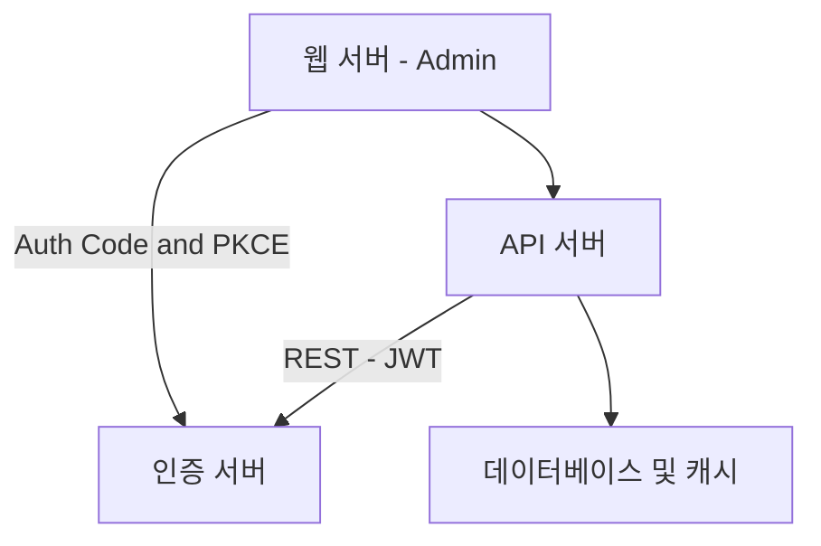
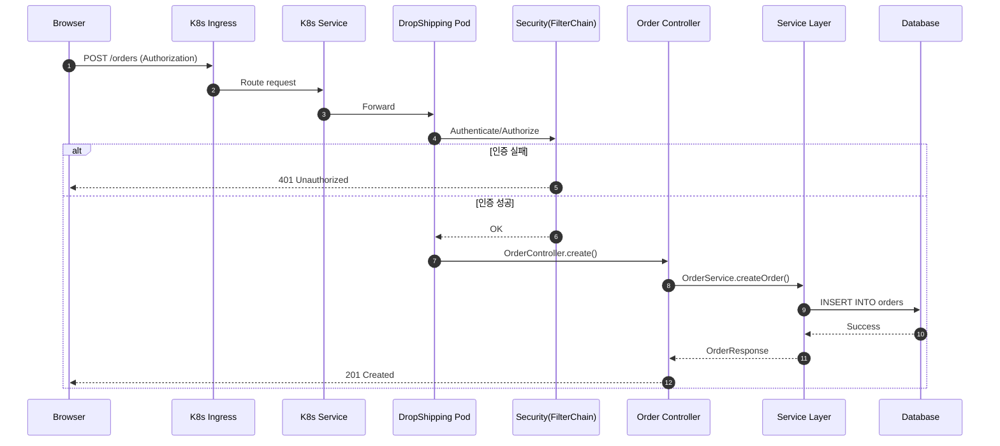

# Drop Shipping Orders API - Claude 작업 지침서

작성자: Claude (Sonnet 4.5)
작성일: 2025-11-12
프로젝트: Drop Shipping Orders API (Spring Boot 3.5.5 + MyBatis + PostgreSQL)

---

## 목차

1. [프로젝트 개요](#프로젝트-개요)
2. [스킬 사용 우선순위](#스킬-사용-우선순위)
3. [신규 기능 추가 프로세스 (dropshipping-feature-add 필수)](#신규-기능-추가-프로세스-dropshipping-feature-add-필수)
4. [Superpowers 스킬 활용 (그 외 작업)](#superpowers-스킬-활용-그-외-작업)
5. [글로벌 가이드라인](#글로벌-가이드라인)
6. [Jira/Wiki 분석 및 디버깅](#jirawiki-분석-및-디버깅)
7. [구현 가이드 참조](#구현-가이드-참조)
8. [Wiki 문서 작성](#wiki-문서-작성)
9. [Mermaid 다이어그램 작성 규칙](#mermaid-다이어그램-작성-규칙)
10. [CTO 설계 리뷰 조건 판단](#cto-설계-리뷰-조건-판단)

---

## 프로젝트 개요

### 서비스 소개
Drop Shipping Orders API는 셀러샵과 공급사샵 간의 주문 중계 시스템입니다.

**핵심 기능:**
- 공급사 관리 (등록, 조회, 수정, 상태 관리)
- 주문 관리 (드랍쉬핑 주문 생성, 조회, 상태 변경)
- Webhook 처리 (셀러 Cafe24 주문 생성 시 자동 매핑, TID 기반 멱등성 보장)
- 상태 동기화 (셀러 ↔ 공급사 간 주문 상태 양방향 동기화)

### 기술 스택
- **언어**: Java 21
- **프레임워크**: Spring Boot 3.5.5
- **빌드**: Gradle 8.x
- **ORM**: MyBatis 3.0.4 (SQL Mapper)
- **DB**: H2 (로컬/테스트), PostgreSQL (운영)
- **캐시**: Redis (TID 중복 체크, 24시간 TTL)
- **테스트**: JUnit 5, Mockito, Spring REST Docs
- **API 문서**: Swagger UI, OpenAPI 3.0
- **DB 마이그레이션**: Flyway 10.21.0

### 프로젝트 구조
```
drop-shipping-orders-api/
├── src/main/java/com/cafe24/api/dropshipping/
│   ├── common/                    # 공통 모듈
│   │   ├── config/                # 설정 클래스
│   │   ├── exception/             # 예외 처리
│   │   ├── util/                  # 유틸리티
│   │   └── constant/              # 상수/Enum
│   └── domain/                    # 도메인 모듈
│       ├── supplier/              # 공급사 도메인
│       │   ├── controller/
│       │   ├── service/
│       │   ├── dao/
│       │   └── model/
│       └── order/                 # 주문 도메인
│           └── (동일 구조)
├── src/main/resources/
│   ├── application.yml
│   ├── db/migration/              # Flyway 마이그레이션
│   └── mybatis/mapper/            # MyBatis Mapper XML
├── docs/                          # 프로젝트 문서
│   ├── dropshipping-implementation-guide.md
│   └── dropshippingdetail/        # 주문 상태별 설계 문서
├── .claude/skills/
│   ├── dropshipping-feature-add/  # 기능 추가 스킬
│   └── msa_project_manager/       # MSA 프로젝트 관리 스킬 (mpm)
├── README.md
├── CONTRIBUTING.md
└── DEVELOPMENT.md
```

---

## 스킬 사용 우선순위

### 작업 유형별 스킬 선택 가이드

**모든 작업을 시작하기 전에 반드시 작업 유형을 식별하고 해당 스킬을 사용:**

#### 1. 신규 기능 추가 → dropshipping-feature-add 스킬 (필수)

**사용 조건:**
- 새로운 API 엔드포인트 추가
- 새로운 비즈니스 로직 구현
- 데이터베이스 스키마 변경을 포함한 기능 추가
- 주문 생명주기 상태 추가
- Webhook 추가/변경

**필수 사용 문구:**
```
"dropshipping-feature-add 스킬 사용해서 {기능명} 추가해줘"
```

**예시:**
- "dropshipping-feature-add 스킬 사용해서 셀러 주문 취소 Webhook 기능 추가해줘"
- "dropshipping-feature-add 스킬 사용해서 공급사 상품 목록 조회 API 추가해줘"

**절대 원칙: 신규 기능 추가는 반드시 dropshipping-feature-add 스킬을 사용해야 합니다.**

---

#### 2. 그 외 모든 작업 → Superpowers 스킬 (우선)

**해당 작업:**
- 버그 분석 및 수정
- 코드 리뷰
- 리팩토링
- 성능 최적화
- Jira/Wiki 분석
- 설계 검토
- 테스트 작성/개선
- 문서 작성

**필수 작업 시작 전 체크리스트:**

1. ☐ 신규 기능 추가인가? → YES: dropshipping-feature-add 사용
2. ☐ 그 외 작업인가? → YES: 아래 superpowers 스킬 체크리스트 진행
3. ☐ 사용 가능한 superpowers 스킬 목록 확인
4. ☐ 현재 작업에 해당하는 스킬이 있는가?
5. ☐ 있다면 → Skill 도구로 해당 스킬 실행
6. ☐ 어떤 스킬을 사용하는지 사용자에게 명시적으로 알림
7. ☐ 스킬의 지침을 정확히 따름

**이 체크리스트를 건너뛰면 안 됩니다. 스킬이 있으면 반드시 사용해야 합니다.**

---

## 신규 기능 추가 프로세스 (dropshipping-feature-add 필수)

### dropshipping-feature-add 스킬 사용 (필수)

**절대 원칙: 이 프로젝트에서 신규 기능을 추가할 때는 반드시 dropshipping-feature-add 스킬을 사용해야 합니다.**

**사용 조건:**
- 새로운 API 엔드포인트 추가
- 새로운 비즈니스 로직 구현
- 데이터베이스 스키마 변경
- 주문 생명주기 상태 추가
- Webhook 추가/변경

**사용 방법:**
```bash
# dropshipping-feature-add 스킬 필수 사용
"dropshipping-feature-add 스킬 사용해서 {기능명} 추가해줘"

# 예시 1: 주문 취소 API
"dropshipping-feature-add 스킬 사용해서 셀러 주문 취소 Webhook 기능 추가해줘"

# 예시 2: 상품 조회 API
"dropshipping-feature-add 스킬 사용해서 공급사 상품 목록 조회 API 추가해줘. 페이징과 정렬 기능 포함"

# 예시 3: 상태 추가
"dropshipping-feature-add 스킬 사용해서 ORDER_SHIPPING 상태 추가해줘"
```

### 자동화된 7단계 워크플로우

dropshipping-feature-add 스킬은 다음 superpowers 스킬들을 자동으로 실행합니다:

**1단계: 요구사항 분석** (`superpowers:brainstorming`)
- 소크라테스식 질문을 통한 요구사항 명확화
- 데이터베이스 스키마 설계 (테이블, 컬럼, 인덱스)
- API 명세 정의 (엔드포인트, 요청/응답 DTO)
- 엣지 케이스 및 예외 시나리오 식별

**2단계: 구현 계획** (`superpowers:writing-plans`)
- Flyway 마이그레이션 SQL 계획
- MyBatis Mapper 계획 (Interface + XML)
- Service/Controller/DTO 계획
- 90% 커버리지 목표 테스트 계획

**3단계: TDD 구현** (`superpowers:test-driven-development`)
- **RED**: DAO/Service/Controller 테스트 작성 → 실패 확인
- **GREEN**: 최소 구현으로 테스트 통과
- **REFACTOR**: 코드 개선 (중복 제거, 네이밍, 성능)
- **커버리지 측정**: `./gradlew test jacocoTestReport` → 90% 이상 강제

**4단계: 코드 리뷰 루프** (`superpowers:code-reviewer` + `superpowers:receiving-code-review`)
- 자동 코드 리뷰 (보안, 성능, 코딩 규칙)
- High/Medium 이슈 수정
- 최대 3회 사이클 반복

**5단계: 실행 검증** (`superpowers:verification-before-completion`)
- 빌드 검증: `./gradlew clean build`
- 애플리케이션 시작: `./gradlew bootRun --args='--spring.profiles.active=local'`
- Swagger UI 검증: http://localhost:8080/swagger-ui/index.html
- API 테스트 (POST, GET, PUT, DELETE)
- H2 Console 데이터 검증: http://localhost:8080/h2-console

**6단계: 문서 업데이트**
- README.md에 새 API 엔드포인트 추가
- CHANGELOG.md 업데이트 (`[v{X}.{Y}.{Z}] - {날짜}`)

**7단계: 종합 리포트 생성**
- 구현 내역 요약
- 테스트 결과 (커버리지, 통과율)
- API 문서 링크
- 생성/수정된 파일 목록

### 완료 기준
- ✅ 모든 High/Medium 이슈 해결
- ✅ 테스트 커버리지 ≥ 90%
- ✅ 모든 테스트 통과
- ✅ 보안 취약점 없음
- ✅ 빌드 성공
- ✅ Swagger UI에서 정상 작동 확인

---

## Superpowers 스킬 활용 (그 외 작업)

### 적용 대상

**다음 작업에서 superpowers 스킬을 우선적으로 사용:**
- 버그 분석 및 수정
- 코드 리뷰
- 리팩토링
- 성능 최적화
- Jira/Wiki 분석
- 설계 검토
- 테스트 작성/개선
- 문서 작성

**신규 기능 추가는 제외 (dropshipping-feature-add 스킬 사용)**

### 주요 Superpowers 스킬 및 사용 시기

#### 1. 설계 및 계획 단계

**brainstorming** (`superpowers:brainstorming`)
- **사용 시기**: 구현 전, 설계를 시작할 때
- **목적**: 소크라테스식 질문을 통해 대략적인 아이디어를 완성된 설계로 발전
- **예시**:
  - "신규 API를 추가해야 하는데 요구사항이 명확하지 않을 때"
  - "데이터베이스 스키마 설계를 검토할 때"
  - "아키텍처 결정이 필요할 때"

**writing-plans** (`superpowers:writing-plans`)
- **사용 시기**: 설계가 완료되고 상세한 구현 작업 계획이 필요할 때
- **목적**: 코드베이스 컨텍스트가 없는 엔지니어도 이해할 수 있는 상세 구현 계획 작성
- **예시**:
  - "정확한 파일 경로와 완전한 코드 예시가 포함된 태스크 목록 작성"
  - "바이트 단위 구현 태스크로 분해"
  - "검증 단계 포함"

#### 2. 구현 단계

**test-driven-development** (`superpowers:test-driven-development`)
- **사용 시기**: 모든 기능 구현 또는 버그 수정 전
- **목적**: 테스트를 먼저 작성하고 실패를 확인한 후 구현
- **워크플로우**:
  1. RED: 테스트 작성 → 실패 확인
  2. GREEN: 최소 구현으로 테스트 통과
  3. REFACTOR: 코드 개선

**testing-anti-patterns** (`superpowers:testing-anti-patterns`)
- **사용 시기**: 테스트 작성 또는 변경, 목 추가 시
- **목적**: 목 동작 테스트, 프로덕션 오염 방지
- **금지 사항**:
  - 목의 동작을 테스트하는 것
  - 테스트 전용 메서드를 프로덕션 코드에 추가
  - 의존성을 이해하지 않고 목 사용

#### 3. 코드 리뷰 단계

**requesting-code-review** (`superpowers:requesting-code-review`)
- **사용 시기**: 태스크 완료, 주요 기능 구현 후, 머지 전
- **목적**: code-reviewer 서브에이전트를 호출하여 구현이 계획/요구사항을 충족하는지 검증
- **사용 예시**:
  - "주요 기능 구현이 완료되었을 때"
  - "PR을 생성하기 전"

**receiving-code-review** (`superpowers:receiving-code-review`)
- **사용 시기**: 코드 리뷰 피드백을 받았을 때
- **목적**: 기술적 엄격함과 검증 요구, 맹목적 구현 방지
- **원칙**:
  - 피드백이 불명확하거나 기술적으로 의심스러우면 확인
  - 단순히 동의하는 것이 아니라 검증

#### 4. 디버깅 및 문제 해결

**systematic-debugging** (`superpowers:systematic-debugging`)
- **사용 시기**: 버그, 테스트 실패, 예상치 못한 동작 발견 시
- **목적**: 솔루션 제안 전 이해 확보
- **4단계 프레임워크**:
  1. 근본 원인 조사
  2. 패턴 분석
  3. 가설 테스트
  4. 구현

**root-cause-tracing** (`superpowers:root-cause-tracing`)
- **사용 시기**: 오류가 실행 깊숙한 곳에서 발생하여 원래 트리거를 찾아야 할 때
- **목적**: 콜 스택을 통해 버그를 체계적으로 역추적
- **방법**:
  - 필요 시 계측 추가
  - 잘못된 데이터 또는 부정확한 동작의 소스 식별

#### 5. 검증 및 완료

**verification-before-completion** (`superpowers:verification-before-completion`)
- **사용 시기**: 작업이 완료, 수정, 통과되었다고 주장하기 전
- **목적**: 주장 전 증거 확보
- **필수 사항**:
  - 검증 명령 실행
  - 출력 확인
  - 성공 주장 전 증거 제시

**condition-based-waiting** (`superpowers:condition-based-waiting`)
- **사용 시기**: 테스트에 경쟁 조건, 타이밍 의존성, 일관성 없는 통과/실패가 있을 때
- **목적**: 임의의 타임아웃을 조건 폴링으로 대체
- **방법**: 실제 상태 변경 대기, 타이밍 추측으로 인한 불안정한 테스트 제거

#### 6. 프로젝트 관리

**using-git-worktrees** (`superpowers:using-git-worktrees`)
- **사용 시기**: 현재 작업 공간과 격리가 필요한 기능 작업 시작 전
- **목적**: 스마트 디렉토리 선택과 안전 검증으로 격리된 git worktree 생성

**finishing-a-development-branch** (`superpowers:finishing-a-development-branch`)
- **사용 시기**: 구현 완료, 모든 테스트 통과, 작업 통합 방법 결정 필요 시
- **목적**: merge, PR, cleanup 옵션 제시

#### 7. 고급 워크플로우

**subagent-driven-development** (`superpowers:subagent-driven-development`)
- **사용 시기**: 현재 세션에서 독립적인 태스크로 구현 계획 실행 시
- **목적**: 각 태스크마다 새로운 서브에이전트 디스패치, 태스크 간 코드 리뷰
- **장점**: 품질 게이트를 통한 빠른 반복

**dispatching-parallel-agents** (`superpowers:dispatching-parallel-agents`)
- **사용 시기**: 공유 상태나 의존성 없이 조사 가능한 3개 이상의 독립적인 실패가 있을 때
- **목적**: 여러 Claude 에이전트를 디스패치하여 독립적인 문제를 동시에 조사 및 수정

**defense-in-depth** (`superpowers:defense-in-depth`)
- **사용 시기**: 잘못된 데이터가 실행 깊숙한 곳에서 실패를 유발할 때
- **목적**: 여러 시스템 계층에서 검증하여 버그를 구조적으로 불가능하게 만듦

### 합리화 방지

**다음과 같은 생각이 들면 즉시 중단하고 스킬을 확인하십시오:**

- "이것은 단순한 질문일 뿐이야" → 잘못됨. 질문도 태스크입니다. 스킬 확인 필요.
- "빠르게 git/파일을 확인할 수 있어" → 잘못됨. 파일에는 대화 컨텍스트가 없습니다. 스킬 확인 필요.
- "먼저 정보를 수집하자" → 잘못됨. 스킬이 정보 수집 방법을 알려줍니다. 스킬 확인 필요.
- "공식 스킬이 필요하지 않아" → 잘못됨. 스킬이 존재하면 사용하세요.
- "이 스킬을 기억해" → 잘못됨. 스킬은 진화합니다. 현재 버전을 실행하세요.
- "이것은 태스크로 간주되지 않아" → 잘못됨. 행동을 취한다면 태스크입니다. 스킬 확인 필요.
- "이것에는 스킬이 과도해" → 잘못됨. 스킬은 단순한 것이 복잡해지기 때문에 존재합니다. 사용하세요.
- "먼저 이것만 할게" → 잘못됨. 무엇이든 하기 전에 스킬을 확인하세요.

### 스킬 사용 알림

스킬을 사용하기 전에 반드시 사용자에게 알려야 합니다:

**형식**: "저는 [스킬 이름] 스킬을 사용하여 [무엇을 하는지]를 진행합니다."

**예시:**
- "저는 brainstorming 스킬을 사용하여 아이디어를 설계로 발전시킵니다."
- "저는 test-driven-development 스킬을 사용하여 이 기능을 구현합니다."
- "저는 systematic-debugging 스킬을 사용하여 이 버그를 분석합니다."

### 스킬 사용 알림

스킬을 사용하기 전에 반드시 사용자에게 알려야 합니다:

**형식**: "저는 [스킬 이름] 스킬을 사용하여 [무엇을 하는지]를 진행합니다."

**예시:**
- "저는 brainstorming 스킬을 사용하여 아이디어를 설계로 발전시킵니다."
- "저는 systematic-debugging 스킬을 사용하여 이 버그를 분석합니다."
- "저는 dropshipping-feature-add 스킬을 사용하여 신규 API를 추가합니다."

---

## 글로벌 가이드라인

### 기본 원칙
- **언어**: 모든 답변과 문서는 한국어로 작성
- **코드 스타일**: Java 네이밍 규칙 준수 (UpperCamelCase, lowerCamelCase, UPPER_SNAKE_CASE)
- **문서 형식**: Markdown 형식 활용
- **이모지**: 사용 금지
- **작성자 명시**: 모든 문서에 작성자(현재 LLM 이름 및 모델) 기입

### 문서 참조 우선순위
1. **구현 가이드**: `docs/dropshipping-implementation-guide.md` - 전체 개발 라이프사이클
2. **설계 문서**: `docs/dropshippingdetail/{상태}.md` - 주문 상태별 상세 설계
3. **README**: `README.md` - 프로젝트 개요 및 빠른 시작
4. **개발 가이드**: `DEVELOPMENT.md` - TDD 워크플로우, 스킬 사용법
5. **협업 가이드**: `CONTRIBUTING.md` - 브랜치 전략, 커밋 규칙, PR 프로세스

### 코드 작성 원칙
- **TDD 필수**: RED-GREEN-REFACTOR 사이클 준수
- **테스트 커버리지**: 90% 이상 필수
- **보안**: SQL Injection, XSS 방지 (MyBatis `#{}` 사용)
- **트랜잭션**: `@Transactional` 적절히 사용
- **로깅**: 구조화된 로깅 (TID, action_type, result, duration_ms)


---

## Jira/Wiki 분석 및 디버깅

### 실행 조건

**다음 조건을 모두 만족할 때만 실행:**
- Jira 코드 또는 Wiki 링크를 받았을 때
- 사용자가 명시적으로 분석을 요청했을 때

**그 외의 요청은 이 프롬프트를 실행하지 말고 일반적으로 진행**

### 사전조건
```yaml
jira_path: .jiras
wiki_path: .wikis
```

### Superpowers 스킬 기반 분석 프로세스

#### 1단계: 문제 분석 (systematic-debugging)

**스킬**: `superpowers:systematic-debugging`

**4단계 프레임워크:**
1. **근본 원인 조사**: Jira 본문과 댓글에서 사실 기반 정보 수집
2. **패턴 분석**: 유사한 이슈 패턴 식별
3. **가설 테스트**: 추정 원인 검증
4. **구현**: 수정 계획 수립

**예시:**
```
"저는 systematic-debugging 스킬을 사용하여 JIRA-12345 이슈를 분석합니다."
```

**활동:**
- Jira 본문 읽기
- 모든 댓글 분석
- 관련 코드 검토
- 로그 및 스택 트레이스 분석
- 재현 조건 파악

#### 2단계: 근본 원인 추적 (root-cause-tracing)

**스킬**: `superpowers:root-cause-tracing`

**활동:**
- 오류가 발생한 지점에서 역방향으로 추적
- 콜 스택을 통해 체계적으로 버그 역추적
- 필요 시 계측 추가하여 데이터 흐름 파악
- 잘못된 데이터 또는 부정확한 동작의 소스 식별

**예시:**
```
"저는 root-cause-tracing 스킬을 사용하여 오류의 원래 트리거를 찾습니다."
```

#### 3단계: 수정 계획 수립 (writing-plans)

**스킬**: `superpowers:writing-plans`

**활동:**
- 최소 범위 수정 계획 작성
- 정확한 파일 경로와 수정 내용 명시
- 테스트 계획 포함
- 예상 소요 시간 산정
- 리스크 평가

#### 4단계: TDD로 수정 구현 (test-driven-development)

**스킬**: `superpowers:test-driven-development`

**활동:**
1. RED: 버그를 재현하는 테스트 작성 → 실패 확인
2. GREEN: 최소 수정으로 테스트 통과
3. REFACTOR: 코드 개선

#### 5단계: 검증 (verification-before-completion)

**스킬**: `superpowers:verification-before-completion`

**활동:**
- 수정 사항 빌드 및 테스트
- 회귀 테스트 실행
- 원래 이슈 재현 불가 확인
- 부작용 없음 확인

### 분석 리포트 작성

**파일 생성 규칙:**
- Wiki: `wiki_path/{wiki_id}_report_{YMDHis}.md`
- Jira: `jira_path/{jira_code}_report_{YMDHis}.md`

**리포트 템플릿:**

```markdown
# {Jira/Wiki} 분석 리포트

작성자: Claude (Sonnet 4.5)
작성일: {YMDHis}
대상: {Jira Code 또는 Wiki ID}
분석 방법: Superpowers 스킬 (systematic-debugging, root-cause-tracing)

---

## 1. 요약
{간단한 요약}

## 2. 문제 분석 (systematic-debugging)

### 2.1. 근본 원인 조사
{Jira 본문 및 댓글 분석 결과}

### 2.2. 패턴 분석
{유사 이슈 패턴}

### 2.3. 가설 테스트
{추정 원인 및 검증 결과}

## 3. 근본 원인 추적 (root-cause-tracing)

### 3.1. 오류 발생 지점
{오류 스택 트레이스 분석}

### 3.2. 역방향 추적
{콜 스택 역추적 결과}

### 3.3. 데이터 흐름 분석
{잘못된 데이터 소스 식별}

## 4. 수정 계획 (writing-plans)

### 4.1. 수정 대상 파일
- {파일 경로 1}
- {파일 경로 2}

### 4.2. 수정 내용
{구체적인 수정 내용, 코드 예시 포함}

### 4.3. 테스트 계획
{재현 테스트, 회귀 테스트}

### 4.4. 예상 소요 시간
{예상 작업 시간}

## 5. 리스크
{예상 리스크 및 대응 방안}

## 6. 검증 계획 (verification-before-completion)
{테스트 및 검증 방법}

---

**다음 단계**: {권장 조치 사항}
```

### Wiki 문서화 (mpm 스킬)

분석이 완료되면 mpm 스킬을 사용하여 Wiki에 문서화합니다.

**사용 방법:**
```bash
# mpm 스킬을 사용하여 분석 리포트를 Wiki에 업로드
"mpm으로 이 분석 리포트를 Wiki에 업로드해줘"
```

**기본 위치:**
```yaml
기본_위키_위치:
  URL: https://wiki.simplexi.com/pages/viewpage.action?pageId=2769863397
  pageId: 2769863397
```

### Jira 코멘트

Jira에 코멘트할 때는 마크다운 형식이 아닌 Jira 코멘트 기본 형식으로 변환합니다.

**예시:**
```
h2. 분석 결과

*근본 원인*: {원인}

*수정 계획*:
# {수정 항목 1}
# {수정 항목 2}

*예상 소요 시간*: {시간}
```

---

## 구현 가이드 참조

### 필수 참조 문서
**위치**: `docs/dropshipping-implementation-guide.md`

**주요 내용:**
1. **프로젝트 아키텍처** (섹션 1)
   - 데이터 흐름, 기술 스택, TID 개념
2. **주문 생명주기** (섹션 2)
   - 10개 상태, 정상/예외 흐름, 상태 전이 규칙
3. **TDD 템플릿** (섹션 4)
   - Controller/Service/DAO/통합 테스트 템플릿
4. **체크리스트** (섹션 5)
   - 구현 전/중/후 체크리스트
5. **코드 리뷰 가이드** (섹션 6)
   - 보안/성능/안정성 관점
6. **RabbitMQ 스키마** (섹션 7)
   - 메시지 구조, Producer/Consumer 예시
7. **DB 마이그레이션** (섹션 8)
   - Flyway 명명 규칙, 템플릿, 롤백 계획
8. **MyBatis Mapper** (섹션 14)
   - SQL Injection 방지, 동적 쿼리, 성능 최적화

### 설계 문서 위치
**디렉토리**: `docs/dropshippingdetail/`

**주문 상태별 문서:**
- `02_ORDER_PLACING.md`: 발주 진행
- `02_ORDER_CONFIRMED.md`: 발주 완료
- `04_ORDER_EXPIRED.md`: 발주 만료
- (기타 상태별 문서 추가 예정)

**참조 방법:**
```bash
# 설계 문서를 읽어서 API 명세, DB 스키마, 시퀀스 다이어그램 추출
Read("docs/dropshippingdetail/02_ORDER_CONFIRMED.md")
```

---

## Wiki 문서 작성

### 사용 시기
- MSA 서비스 설계 문서 검토 (Jira/Wiki)
- CTO 설계 리뷰 필요 여부 판단
- 데이터베이스/캐시/큐 설계 검토
- 성능/안정성/보안 종합 검토
- Confluence Wiki 문서 자동 생성

### 기본 설정
```yaml
기본_위키_위치:
  URL: https://wiki.simplexi.com/pages/viewpage.action?pageId=2769863397
  pageId: 2769863397
  설명: 모든 분석 자료는 이 위키 하위로 생성

문서_작성_원칙:
  언어: 한국어
  이모지: 사용 금지
  다이어그램: Mermaid 필수 (테이블 변환 절대 금지)
  확인_질문: 없이 즉시 적용
```

### mpm 스킬 사용 방법
```bash
# 약어로 빠르게 호출 (추천)
"mpm으로 이 설계를 검토해줘"
"mpm 스킬을 사용해서 이 Jira 이슈를 분석해줘"

# Jira 이슈 기반 검토
"mpm으로 JIRA-12345 이슈를 분석해줘"
"mpm으로 ECHOSTING-67890을 검토해줘"

# Wiki 문서 기반 검토
"mpm으로 https://wiki.simplexi.com/pages/viewpage.action?pageId=123456 문서를 검토해줘"
```

### Wiki 엔드포인트별 프로세스 문서 작성

**입력 변수:**
```yaml
PARENT_PAGE_ID: {{예: 2790316883}}
BASE_TITLE: {{예: EC개발5팀 :: MSA :: DropShipping :: API Docs :: endpoint 별 프로세스}}
REPO_ROOT: /Users/sung-kyu/IdeaProjects/drop-shipping-orders-api
CODEBASE_KIND: spring-java
INCLUDE_METHODS: [GET,POST,PUT,PATCH,DELETE]
K8S_ENABLED: true
CONTROLLER_GLOB: src/main/java/**/controller/**/*.java
SERVICE_GLOB: src/main/java/**/service/**/*.java
```

**페이지 구조:**
1. **부모 페이지**: 5개 차일드 페이지 링크 인덱스
2. **메서드별 차일드 페이지** (GET, POST, PUT, PATCH, DELETE)
   - 요약 표 (엔드포인트, 인증, 권한, DB 작업, 응답)
   - 각 엔드포인트 섹션 (H1: METHOD /path)
   - 한 줄 설명
   - Mermaid 시퀀스 다이어그램 (K8s 기반)
   - 참조 (응답 스키마, Controller, Service)

### Markdown → Confluence HTML 변환

**핵심 전략**: 플레이스홀더 보호 기법
- Mermaid 다이어그램과 코드 블록을 플레이스홀더로 치환
- 테이블 변환 등 다른 처리 수행
- 플레이스홀더를 실제 매크로로 복원

**변환 프로세스 (8단계):**
1. Mermaid 다이어그램을 플레이스홀더로 보호
2. 일반 코드 블록도 플레이스홀더로 보호
3. 테이블 변환 (플레이스홀더가 있는 라인 건너뛰기)
4. 제목 변환 (H1, H2, H3)
5. 리스트 변환
6. 볼드 변환
7. 구분선 제거
8. 플레이스홀더를 실제 매크로로 복원

**검증된 사례:**
- 프로젝트: Drop Shipping Brand App 서비스 구성도
- Mermaid 다이어그램: 7개 (모두 정상 렌더링)
- 테이블: 13개 (모두 정상 변환)
- 페이지 ID: 2800415293

### Wiki 문서 작성 스크립트

**위치**: `.claude/skills/msa_project_manager/scripts/`
- `confluence_create_page.py`: 새 페이지 생성
- `confluence_update.py`: 기존 페이지 업데이트
- `md_to_confluence.py`: Markdown → Confluence HTML 변환

**사용 예시:**
```python
#!/usr/bin/env python3
# docs/dropshippingdetail/03_ORDER_FAILED.md를 Wiki로 업로드

from pathlib import Path
import sys
sys.path.append('.claude/skills/msa_project_manager/scripts')
from md_to_confluence import convert_markdown_to_confluence_html
from confluence_create_page import create_page

# Markdown 읽기
md_path = Path("docs/dropshippingdetail/03_ORDER_FAILED.md")
with open(md_path, 'r', encoding='utf-8') as f:
    md_content = f.read()

# Confluence HTML로 변환
html_content = convert_markdown_to_confluence_html(md_content)

# Wiki 페이지 생성
result = create_page(
    content=html_content,
    title="DropShipping :: 주문 관리 :: 발주 실패 (ORDER_FAILED)",
    parent_id=2769863397  # 기본 위치
)

print(f"페이지 생성 완료: {result['url']}")
```

---

## Mermaid 다이어그램 작성 규칙

### 안전한 Mermaid 작성 원칙

**필수 준수사항:**
- subgraph는 최대 2개까지만 사용
- participant는 8개 이하로 제한
- 특수문자 사용 최소화
- CDATA 섹션 필수
- 한글 레이블 사용 가능

**피해야 할 패턴:**
- 복잡한 중첩 구조
- 과도한 분기(alt/par)
- 특수문자 남용

**권장 패턴:**
- 단순하고 명확한 흐름
- 핵심 프로세스에 집중
- 부가 설명은 텍스트로 보충

### 안전한 Flowchart (graph TD/LR)



**규칙:**
- 노드 선언: `id["라벨"]` 또는 `id[라벨]`만 사용
- 엣지: `id1 --> id2` 또는 `id1 -->|라벨| id2`
- 특수 노드형 금지: (( )), (()), {{ }}, [()] 등
- 연쇄 엣지 금지: `A-->B-->C` (두 줄로 분리)

### 안전한 Sequence Diagram (K8s 기반)



**K8s 시퀀스 다이어그램 규칙:**
- **Participants**: User, Ingress, Ksvc, App, Sec, Ctl, Svc, DB
- **요청 흐름**: User → Ingress → Ksvc → App → Sec → (인증 성공/실패) → Ctl → Svc → DB
- **권한 처리**: POST/PUT/PATCH/DELETE는 권한(ADMIN 등) alt 분기 포함
- **병렬 처리**: 계산형 API는 par 블록으로 규칙/설정 동시 조회 표현

### Confluence Mermaid 매크로 형식

```xml
<ac:structured-macro ac:name="mermaid-macro" ac:schema-version="1">
<ac:plain-text-body><![CDATA[
sequenceDiagram
  autonumber
  participant User as Browser
  participant Ctl as Controller
  participant Svc as Service
  participant DB as Database

  User->>Ctl: POST /orders
  Ctl->>Svc: createOrder()
  Svc->>DB: INSERT
  DB-->>Svc: Success
  Svc-->>Ctl: OrderResponse
  Ctl-->>User: 201 Created
]]></ac:plain-text-body>
</ac:structured-macro>
```

**주요 특징:**
- 매크로명: `mermaid-macro` (일반 코드블록과 구분)
- CDATA 섹션 필수: 특수문자와 라인브레이크 보호
- 스키마 버전: `ac:schema-version="1"`

---

## CTO 설계 리뷰 조건 판단

### 실행 조건
**다음 요청이 왔을 때만 실행:**
- "CTO 리뷰 조건을 판단해달라"
- "CTO 설계 리뷰가 필요한가요?"
- "이 설계가 CTO 리뷰 대상인지 확인해줘"

### 리뷰 프롬프트

당신은 시니어 소프트웨어 아키텍트로서, 대규모 이커머스 플랫폼을 위한 웹서비스 설계를 검토합니다. 다음의 설계 문서를 기반으로 두 가지 리뷰를 진행하세요:

---

## PART 1. 설계 자체에 대한 종합 리뷰
**(성능 / 안정성 / 보안 중심)**

다음 기준을 바탕으로 설계 내용을 정밀하게 검토하십시오.

### 1-1. 성능 관점에서 검토할 사항:
- 트래픽 급증 시 부하 대응 방안이 있는가? (예: 캐시, 비동기 처리, 큐, 샤딩, 병렬화)
- 주요 연산/조회/저장 흐름에서 병목 발생 가능성이 있는가?
- RDB 쿼리 최적화 고려가 있는가? (인덱스, JOIN, 대량 데이터 처리)
- 외부 연동 (API, 파일, 네트워크) 시 타임아웃/리트라이 등 처리 계획이 있는가?

### 1-2. 안정성 관점에서 검토할 사항:
- 장애 발생 시 시스템이 어떻게 복구/우회되도록 설계되었는가? (Failover, Circuit Breaker 등)
- 에러/예외 상황에 대한 로깅 및 알림 체계가 있는가?

### 1-3. 보안 관점에서 검토할 사항:
- 사용자 입력 및 파라미터에 대한 검증이 설계에 포함되어 있는가? (XSS, SQL Injection 방지 등)
- 인증/인가 체계가 명확하게 정의되어 있는가? (세션, 토큰, 역할기반 접근 제어 등)
- 민감 정보(DB, 로그, 통신)의 암호화 및 마스킹이 고려되어 있는가?
- 파일 업로드 및 외부 연동 시 보안 위험에 대한 대응 방안이 있는가?

> 각 항목별로 "양호 / 보통 / 미흡 / 없음" 중 하나로 평가하고, 그 이유를 항목별로 상세하게 기술하세요.
> 종합적으로 설계 수준을 "우수 / 보통 / 미흡"으로 평가하고, 개선이 필요한 영역을 제안하세요.

---

## PART 2. CTO 설계 리뷰 대상 여부 판단
**(사내 필수 절차 준수 확인)**

사내 개발 프로세스에 따라, 아래 조건 중 하나라도 해당하는 경우에는 **CTO의 사전 설계 리뷰가 필수**입니다. 다음 항목을 중심으로 판단하고 결과를 작성하세요:

### CTO 리뷰 필수 여부 판단 기준:

- [ ] DB구조 변경 / File I/O / Network / Cache 등
- [ ] 직접적인 **File에 대한 I/O** 관련 사항이 변경되는 경우
- [ ] RDB 테이블 스키마(컬럼, 인덱스, 제약조건 등)의 **형상 변경**이 포함된 경우
- [ ] 개발 **소요 기간이 2주 이상**으로 예상되는 경우

### 작성 포맷:

- **I/O 변경 사항**: (포함됨 / 불확실 / 없음) — 판단 근거: (간단한 근거 제시)
- **RDB 스키마 변경**: (포함됨 / 불확실 / 없음) — 판단 근거: (간단한 근거 제시)
- **2주 이상 개발 예상**: (포함됨 / 불확실 / 없음) — 판단 근거: (간단한 근거 제시)

> 하나라도 포함됨이면 "**CTO 설계 리뷰 필수 대상입니다**"라고 명시하십시오.
> 불확실한 경우에는 명확히 하기 위해 어떤 추가 정보가 필요한지 구체적으로 명시하십시오.

---

## 참고 문서

### 프로젝트 문서
- **README.md**: 프로젝트 개요, 빠른 시작, API 엔드포인트
- **CONTRIBUTING.md**: 브랜치 전략, 커밋 규칙, PR 프로세스
- **DEVELOPMENT.md**: TDD 워크플로우, 스킬 사용법, 디버깅 가이드
- **CHANGELOG.md**: 버전별 변경 내역

### 구현 가이드
- **docs/dropshipping-implementation-guide.md**: 전체 개발 라이프사이클 가이드
- **docs/dropshippingdetail/{상태}.md**: 주문 상태별 상세 설계

### 스킬 문서
- **.claude/skills/dropshipping-feature-add/SKILL.md**: 기능 추가 스킬 상세 가이드 (superpowers 워크플로우 자동화)
- **.claude/skills/msa_project_manager/SKILL.md**: mpm 스킬 상세 가이드 (27개 전문가 스킬)

### Superpowers 스킬
- **superpowers:brainstorming**: 설계 명확화
- **superpowers:writing-plans**: 구현 계획 작성
- **superpowers:test-driven-development**: TDD 구현
- **superpowers:systematic-debugging**: 체계적 디버깅
- **superpowers:root-cause-tracing**: 근본 원인 추적
- **superpowers:requesting-code-review**: 코드 리뷰 요청
- **superpowers:receiving-code-review**: 리뷰 피드백 처리
- **superpowers:verification-before-completion**: 완료 전 검증
- **superpowers:finishing-a-development-branch**: 브랜치 완료

---

**문서 버전**: 2.1.0
**최종 수정**: 2025-11-12
**작성자**: Claude (Sonnet 4.5)
**주요 변경**:
- 신규 기능 추가 시 dropshipping-feature-add 스킬 필수 사용으로 명확화
- 그 외 작업(분석, 디버깅, 리팩토링 등)은 superpowers 스킬 우선 사용
- 스킬 사용 우선순위 섹션 추가로 작업 유형별 스킬 선택 가이드 제공
