# Shopify 벤치마킹 및 PRO 리포트 개선안

작성자: Claude (Sonnet 4.5)
작성일: 2025-01-22
스킬: orchestrating + benchmarking + brainstorming

---

## 목차

1. [벤치마킹 분석 결과](#벤치마킹-분석-결과)
2. [개선안 기획](#개선안-기획)
3. [구현 로드맵](#구현-로드맵)

---

## 벤치마킹 분석 결과

### 요약

Shopify는 2024년 Analytics 대폭 개편을 통해 "실시간 데이터 + 완전 커스터마이징 + AI 인사이트"를 핵심으로 하는 동적 대시보드를 제공합니다. PRO 리포트는 "월간 성과 증명 + 아바타 인사이트"를 중심으로 한 정적 리포트 형태입니다.

**비교 대상**: Shopify Admin Analytics Dashboard (2024), 카페24 PRO 리포트

**출처**:
- https://www.shopify.com/blog/new-analytics
- https://badger.blue/blogs/ecommerce-unpacked/shopify-analytics-2024-update
- https://kayo.digital/kayo-how/ai-powered-analytics-in-shopify-redefining-ecommerce-insights-for-2024-and-2025/
- PRO 리포트 화면: SCR-20251118-mzlr.png

---

### 1. 핵심 기능 비교

| 항목 | Shopify (2024) | PRO 리포트 | 차이점 |
|------|----------------|-----------|--------|
| 데이터 업데이트 | 실시간 (up-to-the-minute) | 월 1회 (매월 3일) | Shopify는 플래시 세일/프로모션 실시간 모니터링 가능 |
| 대시보드 커스터마이징 | 완전 자유 (드래그앤드롭, 크기 조정, 추가/제거) | 고정 레이아웃 (타입별 3가지) | Shopify는 사용자별 맞춤 뷰 |
| 시각화 옵션 | 15가지 이상 (바 차트, 라인, 도넛, 히스토그램 등) | 4가지 (바 차트, 라인 차트, 도넛, 진행 바) | Shopify가 시각적 다양성 우세 |
| AI 인사이트 | Sidekick AI (자연어 질문 응답, 쿼리 자동 생성, 트렌드/이상 징후 자동 탐지) | 아바타 고정 코멘트 (월 1회) | Shopify는 대화형 AI, PRO는 사전 정의 메시지 |
| 데이터 쿼리 | ShopifyQL (자연어 쿼리) | 미제공 (고정 리포트만) | Shopify는 맞춤 분석 가능 |
| 메트릭 조합 | 자유 조합 (매출+세션+전환율+국가 동시 분석) | 고정 섹션 (6개 KPI 개별 표시) | Shopify는 다차원 분석 가능 |
| 액션 버튼 | 미확인 (검색 결과에 명시 없음) | 링크만 제공 (PRO 후불 광고 배너) | 양측 모두 즉시 실행 기능 약함 |
| 경쟁사/평균 비교 | 미제공 | PRO 평균 비교 제공 | PRO가 상대 평가 강점 |

---

### 2. UI/UX 비교

#### Shopify (2024)

**장점**:
- 메트릭 카드 시스템: 15개 이상 카드 중 선택, 드래그앤드롭으로 자유 배치, 크기 조정 가능
- 실시간 시각화: "rich visualizations"로 플래시 세일, 프로모션 즉시 모니터링
- 설정 패널: 시각화 유형, 날짜 범위 동적 조정
- 다차원 탐색: 단일 뷰에서 메트릭+차원 조합 (예: 국가별 전환율 + 평균 주문액)
- AI 트렌드 하이라이트: 매출 하락, 모바일 트래픽 급증 등 자동 감지
- Sidekick AI: 자연어로 "이번 주 매출이 왜 떨어졌나요?" 질문 시 구매 패턴 분석 후 답변

**단점**:
- 초보자에게는 15개 이상 옵션이 압도적일 수 있음
- 커스터마이징 자유도 높아 초기 설정 시간 필요
- AI 기능이 영어 중심일 가능성 (한국어 지원 여부 미확인)

#### PRO 리포트

**장점**:
- 단일 페이지 스크롤: 모든 정보를 한눈에, 학습 곡선 낮음
- 상단 핵심 카드 3개: PRO 가치 즉시 증명 (1억원, 331.9시간, 38만원)
- 아바타 인사이트: 친근한 캐릭터 + 맞춤 코멘트로 정서적 연결
- 시각적 일관성: 통일된 파란색 바 차트, 명확한 정보 계층
- PRO 전용 섹션: PRO 처리 업무 상세 내역 (6개 엔진별 건수/시간)
- PRO 평균 비교: 동종 업계 대비 내 위치 확인 가능

**단점**:
- 정적 레이아웃: 사용자 맞춤 불가, 관심 없는 섹션도 고정 표시
- 월 1회 업데이트: 당월 중간 성과 파악 불가
- 데이터 탐색 제한: 필터링, 드릴다운, 기간 변경 불가
- 액션 유도 약함: 링크만 제공, 즉시 실행 버튼 없음

---

### 3. 데이터 활용 방식 비교

```mermaid
flowchart TB
    subgraph Shopify2024[Shopify 2024]
        S1[실시간 데이터 수집]
        S2[AI 트렌드 분석]
        S3[이상 징후 자동 탐지]
        S4[Sidekick AI 인사이트]
        S5[사용자 맞춤 쿼리]
        S6[실시간 의사결정]
        S1 --> S2 --> S3 --> S4
        S4 --> S5 --> S6
    end

    subgraph PRO[PRO 리포트]
        P1[월간 데이터 수집]
        P2[집계 및 계산]
        P3[고정 리포트 생성]
        P4[아바타 코멘트]
        P5[사용자 해석]
        P6[외부 액션 이동]
        P1 --> P2 --> P3 --> P4 --> P5 --> P6
    end
```



---

### 4. 핵심 교훈

**Shopify가 우수한 부분**:
- 실시간 데이터로 즉각 대응 가능
- 완전 커스터마이징으로 사용자별 맞춤 뷰
- AI 트렌드 탐지 및 Sidekick 대화형 인사이트
- 15가지 시각화로 데이터 다양성 표현

**PRO 리포트가 우수한 부분**:
- PRO 서비스 가치 증명에 특화 (평균 비교, 처리 업무)
- 단일 페이지 구조로 학습 곡선 낮음
- 아바타 감성 코멘트로 한국 사용자 친화적
- 월간 회고 중심으로 장기 성장 여정 강조

**PRO 리포트 개선 방향**:
- Shopify의 "실시간성"과 "커스터마이징"을 참고하되, PRO 리포트의 "가치 증명" 정체성 유지
- 단기: 트렌드 표시, 조건부 코멘트, 기간 선택
- 중기: 간단한 메트릭 선택, 드릴다운
- 장기: 주간 업데이트, 자연어 질문, 맞춤 대시보드

---

## 개선안 기획

### 설계 원칙

**1. PRO 리포트 정체성 유지**:
- 월간 성장 여정 중심
- PRO 가치 증명 (성과 + 절약)
- 행동 유도 (증명 → 액션)

**2. Shopify 강점 선택적 도입**:
- 트렌드 표시 (전월 대비)
- 조건부 메시지 (AI 유사)
- 액션 버튼 강화

**3. 단계적 개선**:
- Phase 1 (1-2주): 트렌드 + 조건부 메시지
- Phase 2 (1-2개월): 액션 버튼 + 섹션 접기
- Phase 3 (3개월+): 주간 요약 + AI 챗봇

---

### Phase 1: 단기 개선 (1-2주, 개발 3-5일)

#### 1. 트렌드 표시 추가

**목표**: 상단 핵심 카드 3개에 전월 대비 변화 표시

**화면 설계**:

```
현재:
┌─────────────────────┐
│      1억원          │
│ PRO가 만들어준 매출  │
└─────────────────────┘

개선안:
┌─────────────────────────┐
│      1억원 ↑           │
│   전월 대비 +12%       │
│ PRO가 만들어준 매출     │
└─────────────────────────┘
```

**구현 사양**:
- 화살표: 증가(↑ 파란색 #3182CE), 감소(↓ 빨간색 #E53E3E), 유지(→ 회색 #718096)
- 증감률: 절대값 10% 이상 시 bold, 16px
- 위치: 금액 우측 또는 하단 (디자인 팀 확인)
- 데이터 소스: FAS API `/tasks/report-metrics?month={N-1}`

**예외 처리**:
- PRO 첫 달 (전월 데이터 없음): 트렌드 숨김, "다음 달부터 전월 대비 변화를 확인하실 수 있습니다." 표시
- 전월 매출 = 0원: "신규 오픈 축하드려요! 이번 달 매출 XXX원"

---

#### 2. 조건부 아바타 메시지

**목표**: 매출 증감 상황에 따라 다른 메시지와 아바타 표정 표시

**조건 분기**:

| 조건 | 아바타 표정 | 메시지 템플릿 | 액션 제안 |
|------|------------|--------------|----------|
| 매출 증감률 >= +10% | 기쁨 | "축하합니다! 이번 달 매출이 지난달보다 {증감률}% 증가했어요. {증가 요인}이 주효했습니다." | 프로모션으로 재구매 유도, 후불 광고로 신규 고객 확보 |
| +0% ~ +10% | 평온 (미소) | "이번 달도 성장세를 이어가고 있어요. {증가 요인}이 도움이 되었습니다." | 다음 단계 PRO 기능 활용 |
| ±5% 이내 | 평온 | "안정적인 성장세를 유지하고 있어요. 다음 단계로 {제안}을 시도해보세요." | SEO 최적화, SNS 마케팅 |
| -10% ~ -0% | 고민 (생각) | "이번 달 매출이 소폭 감소했어요. {감소 원인} 개선을 고려해보세요." | 전환율 개선, 상품 페이지 최적화 |
| <= -10% | 고민 (진지) | "이번 달 매출이 다소 감소했어요. {감소 원인} 개선이 필요합니다." | SEO 최적화, 할인 프로모션 실행 |

**증감 요인 자동 식별 로직**:

```python
# PRO 매출 기여도에서 Top 2 추출
if 매출_증가:
    기여도_상위 = PRO_매출_기여도.sort(desc).top(2)
    요인 = f"{기여도_상위[0].name}(+{기여도_상위[0].growth}%)"
    # 예: "SEO(+25%)"
else:
    # 전월 대비 하락폭이 큰 항목
    하락_상위 = PRO_매출_기여도.sort(growth_rate).bottom(2)
    요인 = f"{하락_상위[0].name}({하락_상위[0].growth}%)"
    # 예: "트래픽(-15%)"
```

**아바타 이미지**:
- 3가지 표정 (기쁨, 평온, 고민)
- 디자인 팀에 이미지 요청

---

#### 3. 6개 KPI에 PRO 평균 비교 추가

**목표**: 각 KPI 옆에 PRO 평균 및 상대 순위 표시

**화면 설계**:

```
현재:
┌─────────────────────────┐
│ 구매 전환율             │
│ 1.1%                   │
│ [차트]                 │
└─────────────────────────┘

개선안:
┌─────────────────────────────────┐
│ 구매 전환율 ↓ -0.3%p           │
│ 1.1% (지난달: 1.4%)            │
│ [차트]                         │
│                                │
│ PRO 평균: 1.8% (하위 30%)      │
│ ※ 개선이 필요합니다             │
└─────────────────────────────────┘
```

**구현 사양**:
- PRO 평균: FAS API `/tasks/report-metrics/average?month={current}`
- 순위 표시:
  - 상위 20%: "상위 20%" (파란색)
  - 중위 20~80%: "중위권" (회색)
  - 하위 30%: "하위 30%" (빨간색) + "개선이 필요합니다" 메시지
- Red Indicator: 하위 30% 시 카드 테두리 빨간색 강조

---

### Phase 2: 중기 개선 (1-2개월, 개발 1-2주)

#### 4. 액션 버튼 추가

**목표**: Red Indicator 지표에 즉시 실행 가능한 액션 버튼 제공

**액션 버튼 매핑**:

| 지표 문제 | 권장 PRO 기능 | 버튼 텍스트 | 이동 경로 |
|----------|--------------|------------|----------|
| 구매 전환율 하위 30% | SEO 최적화 | [SEO 개선하기 →] | `/admin/pro/seo` |
| 재구매율 하위 30% | CRM 자동화 | [고객 관리 시작 →] | `/admin/pro/crm` |
| 객단가 하위 30% | 상품 추천 엔진 | [추천 기능 설정 →] | `/admin/pro/recommendation` |
| 매출 전반 저조 | 후불 광고 | [광고 시작하기 →] | `/admin/ads/postpaid` |

**버튼 디자인**:
- 배경: 파란색 (#3182CE)
- 텍스트: 흰색, 14px, bold
- 아이콘: 화살표 (→)
- 위치: 카드 하단 중앙

**추적**:
- GA 이벤트: `action_button_click`
- 파라미터: `{indicator: "conversion_rate", action: "seo"}`

---

#### 5. 섹션 접기/펼치기 기능

**목표**: 관심 없는 섹션을 접어서 스크롤 부담 감소

**대상 섹션**:
- 매출 추이
- PRO 매출 기여도
- PRO 처리 업무
- 후불 광고 배너

**UI**:
- 섹션 제목 옆 "▼" 아이콘
- 클릭 시 "▲"로 변경 + 섹션 내용 숨김
- 상태 저장: 브라우저 로컬 스토리지

**구현**:
```javascript
// localStorage에 저장
const collapsedSections = {
  sales_trend: false,
  pro_contribution: false,
  pro_tasks: true  // 접힌 상태
}
localStorage.setItem('pro_report_collapsed', JSON.stringify(collapsedSections))
```

---

#### 6. 기간 선택 드롭다운

**목표**: 과거 데이터 조회 기능 제공

**UI**:
- 위치: 상단 우측
- 옵션: "최근 3개월", "최근 6개월", "최근 1년"
- 기본값: "이번 달" (현재 동작)

**동작**:
- 선택 시 차트만 재렌더링 (AJAX)
- 페이지 리로드 없음
- API: 기존 엔드포인트에 `?period=3m` 파라미터 추가

---

### Phase 3: 장기 검토 (3개월+, 개발 3-4주)

#### 7. 주간 요약 이메일

**목표**: 월 1회 리포트 한계 보완

**내용**:
- 핵심 카드 3개 (간소화 버전)
- 아바타 코멘트 (주간 버전)
- 주요 액션 제안 1개

**발송**:
- 시간: 매주 월요일 오전 9시
- 조건: 사용자 설정에서 활성화
- 템플릿: HTML 이메일

---

#### 8. 간단한 자연어 질문 (AI 챗봇)

**목표**: Shopify Sidekick 유사 기능

**기능**:
- 입력: "이번 달 매출이 왜 떨어졌나요?"
- 출력: "트래픽은 유지되었지만, 구매 전환율이 1.4%에서 1.1%로 하락했습니다. 상품 페이지 최적화를 권장합니다."

**기술 스택 옵션**:
1. OpenAI API (비용 높음, 품질 우수)
2. 내부 AI 모델 (비용 낮음, 개발 필요)
3. 템플릿 기반 (비용 없음, 유연성 낮음)

**제한**:
- 월 10회 질문 (비용 관리)
- 한국어만 지원

---

#### 9. 사용자 정의 대시보드

**목표**: Shopify 메트릭 카드 시스템 (단순화 버전)

**기능**:
- 섹션 선택: 6개 섹션 중 3-5개 선택
- 순서 변경: 드래그앤드롭
- 저장: "내 대시보드"로 계정별 저장

**저장 위치**:
- DB 테이블: `user_dashboard_config`
- 필드: `user_id`, `sections` (JSON)

---

## 구현 로드맵

### 타임라인

| Phase | 기간 | 개발 일정 | 주요 산출물 |
|-------|------|----------|-----------|
| Phase 1 | 1-2주 | 3-5일 | 트렌드 표시, 조건부 메시지, PRO 평균 비교 |
| Phase 2 | 1-2개월 | 1-2주 | 액션 버튼, 섹션 접기, 기간 선택 |
| Phase 3 | 3개월+ | 3-4주 | 주간 이메일, AI 챗봇, 맞춤 대시보드 |

---

### 검증 필요 사항

**데이터 API**:
1. FAS API `/tasks/report-metrics?month={N-1}` 존재 여부 확인
2. FAS API `/tasks/report-metrics/average` PRO 평균 데이터 제공 가능 여부
3. 전월 데이터 호출 시 성능 영향 (캐싱 전략)

**디자인 리소스**:
1. 아바타 이미지 3가지 (기쁨, 평온, 고민)
2. 화살표 아이콘 (↑↓→)
3. 액션 버튼 디자인 가이드

**기술 검토**:
1. 조건부 메시지 로직 검증 (QA 시나리오)
2. 섹션 접기 로컬 스토리지 용량 제한
3. AI 챗봇 비용 산정 (OpenAI API 호출 빈도)

---

### 다음 단계

1. **Phase 1 기술 스펙 작성** (writing-plans 스킬)
   - API 엔드포인트 상세 정의
   - 데이터 모델 설계
   - 화면 정의서 작성 (Figma 연동)

2. **API 담당자 확인**
   - FAS API 전월 데이터 제공 여부
   - PRO 평균 데이터 계산 방법
   - 응답 시간 및 캐싱 전략

3. **디자인 팀 협업**
   - 아바타 이미지 3종 요청
   - 트렌드 표시 레이아웃 확정
   - 액션 버튼 스타일 가이드

4. **개발 우선순위 협의**
   - Phase 1 개발 착수일 확정
   - QA 일정 조율
   - 배포 계획 수립

---

## 참고 자료

- [Shopify 새로운 Analytics 공식 발표](https://www.shopify.com/blog/new-analytics)
- [Shopify Analytics 2024 업데이트 분석](https://badger.blue/blogs/ecommerce-unpacked/shopify-analytics-2024-update)
- [AI 기반 Shopify Analytics 가이드](https://kayo.digital/kayo-how/ai-powered-analytics-in-shopify-redefining-ecommerce-insights-for-2024-and-2025/)
- [Shopify Polaris Design System](https://polaris-react.shopify.com/)
- PRO 리포트 화면: SCR-20251118-mzlr.png
- PRO 리포트 사양서: CLAUDE.md

---

**문서 버전**: 1.0
**작성자**: Claude (Sonnet 4.5)
**스킬**: orchestrating + benchmarking + brainstorming
**다음 업데이트**: Phase 1 기술 스펙 작성 후
