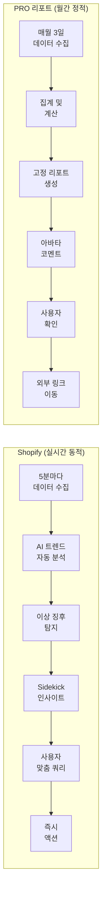

# Shopify 벤치마킹 및 PRO 리포트 개선안

작성자: Claude (Sonnet 4.5)
작성일: 2025-01-22
스킬: benchmarking

---

## 목차

1. [비교 개요](#비교-개요)
2. [섹션별 상세 비교](#섹션별-상세-비교)
3. [개선안 우선순위](#개선안-우선순위)
4. [구현 로드맵](#구현-로드맵)

---

## 비교 개요

### 기본 정보

| 구분 | Shopify Analytics (2024) | 카페24 PRO 리포트 |
|------|-------------------------|------------------|
| **출시/개편** | 2024년 대폭 개편 | 2024년 신규 출시 |
| **핵심 컨셉** | 실시간 동적 대시보드 | 월간 성장 리포트 |
| **타겟 사용자** | 글로벌 온라인 쇼핑몰 운영자 | 카페24 PRO 서비스 가입자 |
| **업데이트 주기** | 실시간 (5분 단위) | 월 1회 (매월 3일) |
| **데이터 출처** | Shopify 자체 데이터 | CA 2.0, FAS, 마켓플러스 API |

### 출처

- Shopify: https://www.shopify.com/blog/new-analytics
- Shopify Analytics 2024: https://badger.blue/blogs/ecommerce-unpacked/shopify-analytics-2024-update
- AI Analytics: https://kayo.digital/kayo-how/ai-powered-analytics-in-shopify-redefining-ecommerce-insights-for-2024-and-2025/
- PRO 리포트: SCR-20251118-mzlr.png, CLAUDE.md

---

## 섹션별 상세 비교

### 1. 상단 핵심 지표 카드

| 항목 | Shopify | PRO 리포트 |
|------|---------|-----------|
| **카드 개수** | 15개 이상 (선택 가능) | 3개 고정 |
| **표시 지표** | 매출, 세션, 전환율, AOV, 신규 고객 등 | PRO 매출, 절약 시간, PRO 혜택 |
| **커스터마이징** | 드래그앤드롭 자유 배치 | 고정 레이아웃 |
| **트렌드 표시** | 실시간 변화율 (%, 화살표) | 미제공 |
| **시각화** | 미니 차트 포함 | 숫자만 표시 |
| **인터랙션** | 클릭 시 상세 페이지 이동 | 정적 표시 |

**화면 구성 비교:**

```
┌─────────────────────────────────────────────┬─────────────────────────────────────────────┐
│ Shopify                                     │ PRO 리포트                                   │
├─────────────────────────────────────────────┼─────────────────────────────────────────────┤
│ ┌──────┐ ┌──────┐ ┌──────┐ ┌──────┐        │ ┌──────────┐ ┌──────────┐ ┌──────────┐     │
│ │ 매출 │ │ 세션 │ │ 전환 │ │ AOV  │        │ │  1억원   │ │ 331.9시간│ │  38만원  │     │
│ │ $50K │ │ 10K  │ │ 2.5% │ │ $45  │        │ │ PRO 매출 │ │ 절약시간 │ │ PRO혜택  │     │
│ │ +15% │ │ +8%  │ │ +0.3 │ │ -2%  │        │ └──────────┘ └──────────┘ └──────────┘     │
│ │[차트]│ │[차트]│ │[차트]│ │[차트]│        │                                             │
│ └──────┘ └──────┘ └──────┘ └──────┘        │                                             │
│                                             │                                             │
│ [+ 카드 추가] [배치 변경]                   │ (고정 레이아웃)                              │
└─────────────────────────────────────────────┴─────────────────────────────────────────────┘
```

**개선 포인트:**
- PRO 리포트에 전월 대비 트렌드 표시 추가 필요
- 미니 차트는 과도, 화살표와 증감률만 추가

---

### 2. AI/아바타 인사이트

| 항목 | Shopify Sidekick AI | PRO 리포트 아바타 |
|------|---------------------|------------------|
| **형태** | 대화형 AI 챗봇 | 고정 코멘트 |
| **입력 방식** | 자연어 질문 | 자동 생성 |
| **인사이트 생성** | 실시간 데이터 분석 후 답변 | 사전 정의된 템플릿 |
| **트렌드 감지** | 자동 (매출 하락, 트래픽 급증 등) | 미제공 |
| **액션 제안** | 구체적 (예: "할인 10% 프로모션 실행") | 일반적 (예: "PRO 기능 활용") |
| **언어 지원** | 영어 중심 (한국어 미확인) | 한국어 |
| **개인화** | 사용자별 맞춤 분석 | 동일 템플릿 |

**인터랙션 비교:**

```
┌─────────────────────────────────────────────┬─────────────────────────────────────────────┐
│ Shopify Sidekick AI                         │ PRO 리포트 아바타                            │
├─────────────────────────────────────────────┼─────────────────────────────────────────────┤
│ 사용자: "이번 주 매출이 왜 떨어졌나요?"      │        [아바타 이미지]                       │
│                                             │                                             │
│ Sidekick: "분석 결과, 모바일 트래픽은       │  "이번 달 PRO가 처리한 업무가               │
│ 유지되었으나 구매 전환율이 2.5%에서         │   331.9시간입니다.                          │
│ 1.8%로 하락했습니다.                        │   시간을 환산하면 38만원을 절약했어요!"      │
│                                             │                                             │
│ 주요 원인:                                  │  (고정 메시지)                               │
│ - 체크아웃 페이지 이탈률 15% 증가           │                                             │
│ - 결제 오류 3건 발생                        │                                             │
│                                             │                                             │
│ 권장 액션:                                  │                                             │
│ [체크아웃 최적화 →] [오류 확인 →]          │                                             │
│                                             │                                             │
│ 사용자: "체크아웃 페이지 개선 방법은?"      │                                             │
│ Sidekick: "다음 3가지를 권장합니다..."      │                                             │
└─────────────────────────────────────────────┴─────────────────────────────────────────────┘
```

**개선 포인트:**
- PRO 리포트에 조건부 아바타 메시지 추가 (매출 증감에 따라 다른 표정/메시지)
- 증감 요인 자동 식별 로직 추가

---

### 3. 매출 분석 차트

| 항목 | Shopify | PRO 리포트 |
|------|---------|-----------|
| **차트 종류** | 15가지 이상 (라인, 바, 도넛, 히트맵 등) | 4가지 (라인, 바, 도넛, 진행바) |
| **기간 선택** | 동적 (오늘, 어제, 지난주, 지난달, 커스텀) | 고정 (당월만) |
| **비교 기능** | 전년 동기, 전월 비교 토글 | 미제공 |
| **드릴다운** | 가능 (클릭 시 상세 분석) | 불가 |
| **데이터 조합** | 다차원 (매출+국가+기기 동시) | 단일 차원 |
| **필터링** | 실시간 필터 (상품, 채널, 고객 등) | 미제공 |

**차트 UI 비교:**

```
┌─────────────────────────────────────────────┬─────────────────────────────────────────────┐
│ Shopify                                     │ PRO 리포트                                   │
├─────────────────────────────────────────────┼─────────────────────────────────────────────┤
│ 매출 추이 [오늘▼] [vs 전년 동기 ☑]         │ 매출 추이                                    │
│                                             │                                             │
│   $80K ┃                              ╱─   │  1.2억┃              ╱─                     │
│        ┃                         ╱────     │       ┃         ╱────                        │
│   $60K ┃                    ╱────          │  1.0억┃    ╱────                            │
│        ┃               ╱────                │       ┃╱────                                │
│   $40K ┃          ╱────  (올해)            │  0.8억┗━━━━━━━━━━━━━━━━━━━━━━━━━           │
│        ┃     ╱────                          │        1월  2월  3월  4월  5월  6월         │
│   $20K ┃╱────    (작년, 점선)               │                                             │
│        ┗━━━━━━━━━━━━━━━━━━━━━━━━━━━       │  ├ 자사몰 매출 (파란색)                      │
│         1월  2월  3월  4월  5월  6월        │  └ 연동 마켓 매출 (회색)                     │
│                                             │                                             │
│ [상품별▼] [채널별▼] [국가별▼] [기기별▼]    │  (필터 없음, 고정 표시)                      │
│                                             │                                             │
│ → 클릭 시 상세 분석 페이지 이동              │  (정적 차트)                                 │
└─────────────────────────────────────────────┴─────────────────────────────────────────────┘
```

**개선 포인트:**
- PRO 리포트에 기간 선택 드롭다운 추가 (최근 3개월, 6개월, 1년)
- 전월 대비 비교선 추가 (점선)

---

### 4. KPI 대시보드

| 항목 | Shopify | PRO 리포트 |
|------|---------|-----------|
| **KPI 개수** | 사용자 정의 (무제한) | 6개 고정 |
| **표시 방식** | 카드 또는 리스트 | 카드 6개 |
| **벤치마크** | 미제공 | PRO 평균 비교 |
| **Red Indicator** | 미제공 | 하위 30% 시 빨간 테두리 |
| **액션 버튼** | 미제공 | 링크만 제공 |
| **순위 표시** | 미제공 | 상위/중위/하위 표시 |

**KPI 카드 비교:**

```
┌─────────────────────────────────────────────┬─────────────────────────────────────────────┐
│ Shopify                                     │ PRO 리포트                                   │
├─────────────────────────────────────────────┼─────────────────────────────────────────────┤
│ ┌──────────────┐ ┌──────────────┐          │ ┌───────────────────────────────────┐        │
│ │ 구매 전환율  │ │ 재구매율     │          │ │ 구매 전환율                       │        │
│ │ 2.5%         │ │ 35%          │          │ │ 1.1%                              │        │
│ │              │ │              │          │ │ [차트]                            │        │
│ │ [미니차트]   │ │ [미니차트]   │          │ │                                   │        │
│ └──────────────┘ └──────────────┘          │ └───────────────────────────────────┘        │
│                                             │                                             │
│ (벤치마크 없음)                             │ ┌───────────────────────────────────┐        │
│                                             │ │ 구매 전환율 ↓ -0.3%p              │ (RED)  │
│                                             │ │ 1.1% (지난달: 1.4%)               │        │
│                                             │ │ [차트]                            │        │
│                                             │ │                                   │        │
│                                             │ │ PRO 평균: 1.8% (하위 30%)         │        │
│                                             │ │ ※ 개선이 필요합니다                │        │
│                                             │ │                                   │        │
│                                             │ │ [SEO 개선하기 →] (버튼 없음)      │        │
│                                             │ └───────────────────────────────────┘        │
└─────────────────────────────────────────────┴─────────────────────────────────────────────┘
```

**개선 포인트:**
- PRO 리포트의 PRO 평균 비교는 강점, 유지
- 액션 버튼을 링크가 아닌 실제 버튼으로 변경
- 트렌드 화살표 추가

---

### 5. 데이터 쿼리/탐색

| 항목 | Shopify | PRO 리포트 |
|------|---------|-----------|
| **쿼리 언어** | ShopifyQL (자연어) | 미제공 |
| **맞춤 분석** | 가능 (메트릭 조합) | 불가 |
| **저장/공유** | 대시보드 저장 가능 | 불가 |
| **내보내기** | CSV, Excel | 미제공 |
| **API 접근** | REST/GraphQL API | 미제공 (내부 API만) |

**쿼리 인터페이스 비교:**

```
┌─────────────────────────────────────────────┬─────────────────────────────────────────────┐
│ Shopify                                     │ PRO 리포트                                   │
├─────────────────────────────────────────────┼─────────────────────────────────────────────┤
│ [검색창]                                    │                                             │
│ "서울 지역 모바일 사용자의 평균 주문액"      │  (맞춤 쿼리 기능 없음)                       │
│                                             │                                             │
│ → 자동 쿼리 생성:                            │                                             │
│   SELECT avg(order_value)                   │                                             │
│   FROM orders                               │                                             │
│   WHERE city = 'Seoul'                      │                                             │
│     AND device = 'mobile'                   │                                             │
│                                             │                                             │
│ 결과: ₩45,200 (150건)                       │                                             │
│                                             │                                             │
│ [대시보드에 추가] [CSV 내보내기]             │                                             │
└─────────────────────────────────────────────┴─────────────────────────────────────────────┘
```

**개선 포인트:**
- PRO 리포트는 고정 리포트 컨셉 유지 (쿼리 기능 불필요)
- 대신 주요 필터링만 제공 (기간 선택)

---

### 6. 데이터 흐름 비교



---

### 7. 장단점 비교표

| 구분 | Shopify 장점 | Shopify 단점 | PRO 리포트 장점 | PRO 리포트 단점 |
|------|------------|-------------|----------------|----------------|
| **데이터** | 실시간 업데이트 | - | PRO 가치 증명 특화 | 월 1회만 업데이트 |
| **커스터마이징** | 완전 자유 배치 | 초보자에게 복잡 | 단순 명확 | 맞춤 불가 |
| **AI/인사이트** | 대화형 실시간 분석 | 영어 중심 | 한국어 친화적 | 고정 템플릿 |
| **시각화** | 15가지 이상 | - | 4가지로 충분 | 선택 불가 |
| **벤치마크** | 없음 | - | PRO 평균 비교 | - |
| **액션** | 구체적 제안 | 버튼 미확인 | - | 링크만 제공 |
| **학습 곡선** | 높음 (설정 복잡) | - | 낮음 (즉시 이해) | - |

---

## 개선안 우선순위

### Phase 1: 단기 개선 (1-2주, 개발 3-5일)

| 순위 | 기능 | Shopify 참고 | 구현 방식 | 우선순위 |
|------|------|-------------|-----------|---------|
| 1 | 트렌드 표시 | 화살표 + 증감률 | 상단 카드 3개에 전월 대비 표시 | 최우선 |
| 2 | 조건부 메시지 | Sidekick AI | 아바타 3가지 표정 + 증감 조건별 메시지 | 최우선 |
| 3 | PRO 평균 비교 | (없음, PRO 강점) | 6개 KPI에 순위 표시 (상위/중위/하위) | 높음 |

**트렌드 표시 예시:**

```
Before:                          After:
┌─────────────────┐             ┌─────────────────────┐
│   1억원         │             │   1억원 ↑ +12%      │
│ PRO 매출        │    →        │ PRO 매출            │
└─────────────────┘             └─────────────────────┘
```

**조건부 메시지 매핑:**

| 매출 증감률 | 아바타 | 메시지 템플릿 | 액션 제안 |
|-----------|--------|--------------|----------|
| ≥ +10% | 기쁨 | "축하합니다! {증감률}% 증가, {요인}이 주효했습니다" | 프로모션 재구매 유도 |
| 0~+10% | 미소 | "성장세 유지, {요인}이 도움되었습니다" | 다음 PRO 기능 |
| ±5% | 평온 | "안정적 유지, {제안} 시도해보세요" | SEO, SNS |
| -10~0% | 생각 | "소폭 감소, {원인} 개선 고려" | 전환율 개선 |
| ≤ -10% | 진지 | "감소, {원인} 개선 필요" | SEO, 할인 |

---

### Phase 2: 중기 개선 (1-2개월, 개발 1-2주)

| 순위 | 기능 | Shopify 참고 | 구현 방식 | 우선순위 |
|------|------|-------------|-----------|---------|
| 4 | 액션 버튼 | (미확인) | Red Indicator에 즉시 실행 버튼 | 중간 |
| 5 | 섹션 접기 | (없음) | 관심 없는 섹션 숨김 (로컬 저장) | 중간 |
| 6 | 기간 선택 | 동적 기간 선택 | 드롭다운 (3/6/12개월) | 중간 |

**액션 버튼 매핑:**

| 문제 지표 | PRO 기능 | 버튼 | 경로 |
|----------|---------|------|------|
| 전환율 하위 30% | SEO | [SEO 개선 →] | /admin/pro/seo |
| 재구매율 하위 30% | CRM | [고객 관리 →] | /admin/pro/crm |
| 객단가 하위 30% | 추천 | [추천 설정 →] | /admin/pro/recommendation |
| 매출 저조 | 광고 | [광고 시작 →] | /admin/ads/postpaid |

---

### Phase 3: 장기 검토 (3개월+, 개발 3-4주)

| 순위 | 기능 | Shopify 참고 | 구현 방식 | 우선순위 |
|------|------|-------------|-----------|---------|
| 7 | 주간 이메일 | (없음) | 간소화 주간 요약 발송 | 낮음 |
| 8 | AI 챗봇 | Sidekick AI | 자연어 질문 (월 10회 제한) | 낮음 |
| 9 | 맞춤 대시보드 | 메트릭 카드 | 섹션 선택/순서 변경 | 낮음 |

**우선순위 결정 기준:**
- Phase 1: PRO 정체성 유지하며 즉시 효과
- Phase 2: UX 개선, 중간 개발
- Phase 3: 고비용, 장기 검토

---

## 구현 로드맵

### 타임라인

| Phase | 기간 | 개발 일정 | 주요 산출물 |
|-------|------|----------|-----------|
| **Phase 1** | 1-2주 | 3-5일 | 트렌드 표시, 조건부 메시지, PRO 평균 비교 |
| **Phase 2** | 1-2개월 | 1-2주 | 액션 버튼, 섹션 접기, 기간 선택 |
| **Phase 3** | 3개월+ | 3-4주 | 주간 이메일, AI 챗봇, 맞춤 대시보드 |

### 검증 필요 사항

**데이터 API:**
1. FAS API `/tasks/report-metrics?month={N-1}` 존재 여부
2. FAS API `/tasks/report-metrics/average` PRO 평균 데이터 제공 여부
3. 전월 데이터 호출 시 성능 영향 (캐싱 전략)

**디자인 리소스:**
1. 아바타 이미지 3가지 (기쁨, 평온, 고민)
2. 화살표 아이콘 (↑↓→)
3. 액션 버튼 디자인 가이드

**기술 검토:**
1. 조건부 메시지 로직 검증 (QA 시나리오)
2. 섹션 접기 로컬 스토리지 용량 제한
3. AI 챗봇 비용 산정 (OpenAI API 호출 빈도)

---

### 다음 단계

1. **Phase 1 기술 스펙 작성**
   - API 엔드포인트 상세 정의
   - 데이터 모델 설계
   - 화면 정의서 작성 (Figma 연동)

2. **API 담당자 확인**
   - FAS API 전월 데이터 제공 여부
   - PRO 평균 데이터 계산 방법
   - 응답 시간 및 캐싱 전략

3. **디자인 팀 협업**
   - 아바타 이미지 3종 요청
   - 트렌드 표시 레이아웃 확정
   - 액션 버튼 스타일 가이드

4. **개발 우선순위 협의**
   - Phase 1 개발 착수일 확정
   - QA 일정 조율
   - 배포 계획 수립

---

## 참고 자료

- [Shopify 새로운 Analytics 공식 발표](https://www.shopify.com/blog/new-analytics)
- [Shopify Analytics 2024 업데이트 분석](https://badger.blue/blogs/ecommerce-unpacked/shopify-analytics-2024-update)
- [AI 기반 Shopify Analytics 가이드](https://kayo.digital/kayo-how/ai-powered-analytics-in-shopify-redefining-ecommerce-insights-for-2024-and-2025/)
- [Shopify Polaris Design System](https://polaris-react.shopify.com/)
- PRO 리포트 화면: SCR-20251118-mzlr.png
- PRO 리포트 사양서: CLAUDE.md

---

**문서 버전**: 2.0 (도표 중심 재구성)
**작성자**: Claude (Sonnet 4.5)
**스킬**: benchmarking
**다음 업데이트**: Phase 1 기술 스펙 작성 후
